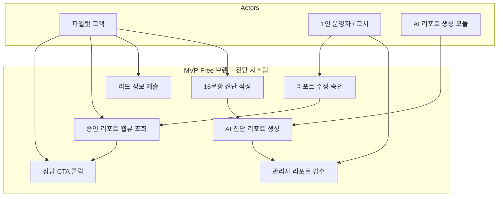
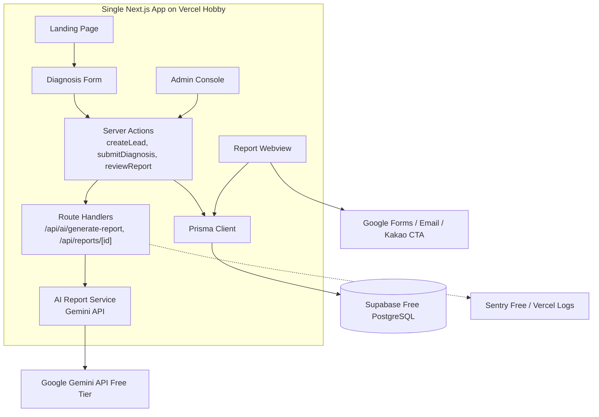
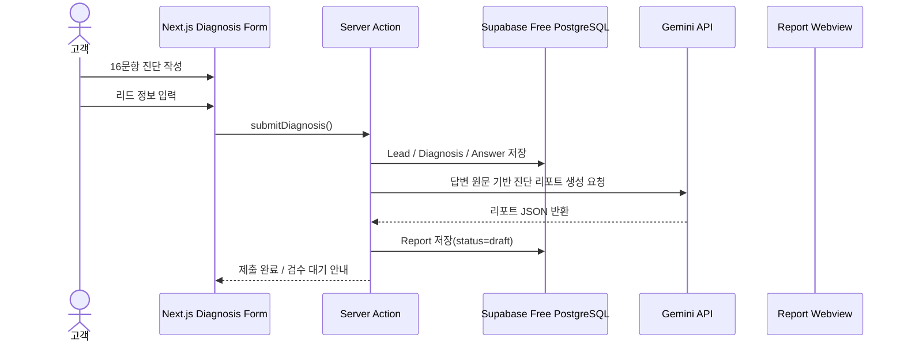
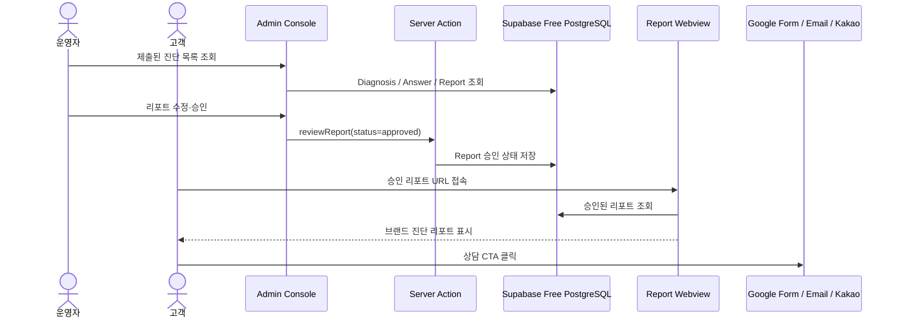

# AI 작업용 SRS 수정 PLAN 문서  
## SRS v1.1 → v1.3 Zero-Cost Personal MVP Revision 작업 지시서

- **문서 목적**: AI에게 기존 SRS 문서를 직접 수정하도록 지시하기 위한 작업 PLAN
- **대상 문서**: `SRS_v0_2.md` / Revision 1.1
- **목표 개정본**: `SRS v1.3 — Zero-Cost Personal MVP Revision`
- **수정 핵심**: 개인이 완전 바이브코딩으로 구현 가능한 수준으로 기능 범위를 축소하고, 완전 무료 인프라 제약과 기존 비기능 요구사항 사이의 기술적 모순을 해소한다.
- **작업 방식**: 기존 SRS의 전체 구조는 유지하되, Scope / Constraints / System Context / API / Requirements / NFR / Traceability / Appendix / Open Issues를 v1.3 기준으로 전면 조정한다.

---

# 0. AI 작업 지시 총괄 프롬프트

아래 프롬프트를 AI에게 먼저 입력한다.

```markdown
너는 소프트웨어 요구사항 명세서(SRS) 리팩토링 전문가다.

첨부된 기존 SRS 문서를 기반으로, 문서 전체를 `SRS v1.3 — Zero-Cost Personal MVP Revision`으로 수정하라.

수정의 핵심 목적은 다음과 같다.

1. 초급 수준의 SW 배경지식을 가진 1인이 완전 바이브코딩으로 구현 가능한 MVP 수준으로 개발 난이도를 낮춘다.
2. 목표 인프라는 완전 무료 인프라다.
3. 기존 SRS의 99.9% SLA, 동시접속자 100명/500명, Datadog/UptimeRobot/Slack Alert, 마스터 브리프 자동 생성, 42문항 전체 처리, 교차검증 9개 등은 무료 인프라 및 개인 구현 목표와 충돌하므로 수정·축소·후순위화한다.
4. 제품의 핵심 가치는 유지한다. 즉, “16문항 진단 → 리드/답변 저장 → AI 진단 리포트 생성 → 관리자 검수 → 승인 리포트 웹뷰 → 상담 CTA” 흐름은 반드시 유지한다.
5. 기존 SRS의 기능 요구사항 중 F1, F10, F11, F15, 교차검증, 마스터 브리프, 원라이너 자동 생성은 MVP-Free 범위에서 제외하거나 V1.5/V2로 이동한다.
6. 문서는 개발자 협업용 SRS가 아니라, 개인이 AI와 함께 구현할 수 있는 실행 가능한 SRS가 되어야 한다.
7. 수정 후에는 Traceability Matrix, Non-Functional Requirements, System Context, API Overview, Open Issues가 새 범위와 모순 없이 일치해야 한다.

아래의 섹션별 작업 지시를 순서대로 적용하라.
```

---

# 1. 문서 메타데이터 수정

## 1.1 수정 대상

문서 최상단 메타데이터 및 개정 이력.

## 1.2 AI 작업 명령

```markdown
문서 상단의 메타데이터를 다음 기준으로 수정하라.

- Revision을 `1.1`에서 `1.3`으로 변경한다.
- Status를 `Draft — Zero-Cost Personal MVP Revision`으로 변경한다.
- Date는 현재 문서 날짜를 유지하거나 수정 작업일 기준으로 갱신한다.
- Authors는 기존 값을 유지하되, 변경 내용 요약에 `AI Ops / Personal MVP Revision`을 추가한다.
```

## 1.3 개정 이력 추가 지시

기존 개정 이력 아래에 다음 행을 추가한다.

```markdown
| **1.3** | **2026-04-26** | **AI Ops / Personal MVP Revision** | **Zero-Cost Personal MVP 조정** — 개인 구현 가능성과 완전 무료 인프라 제약을 반영하여 MVP 범위를 축소. 16문항 진단·리드/답변 저장·AI 진단 리포트·관리자 검수·승인 리포트 웹뷰·상담 CTA를 P0로 재정의. 마스터 브리프 8섹션, 42문항 전체 처리, F15 코치 분석 노트, 원라이너 3종, 교차검증 9개, Datadog/UptimeRobot/Slack Alert, Typeform 자동 연동, 복잡한 RBAC는 V1.5/V2로 이동. 99.9% SLA 및 고동시접속 요구를 제거하고 Best-effort 무료 파일럿 기준으로 비기능 요구사항 재작성. |
```

## 1.4 검수 기준

- 문서 전체에서 Revision 1.1 표기가 주요 메타데이터에 남아 있지 않아야 한다.
- v1.3 개정 목적이 “기능 추가”가 아니라 “무료 개인 MVP 현실화”로 명확히 드러나야 한다.

---

# 2. 1.1 Purpose 수정

## 2.1 기존 문제

기존 Purpose는 전체 프리미엄 브랜드 매니지먼트 시스템을 목표로 한다.  
하지만 v1.3은 전체 시스템이 아니라 무료 인프라 기반 파일럿 MVP다.

## 2.2 AI 작업 명령

```markdown
`1.1 Purpose` 섹션을 다음 구조로 재작성하라.

1. 전체 제품 비전은 유지하되, v1.3의 목적은 별도로 정의한다.
2. v1.3의 목적은 “완전 무료 인프라에서 개인이 구현 가능한 브랜드 진단 파일럿 MVP”라고 명시한다.
3. 42문항 전체 인터뷰, 마스터 브리프 8섹션, B2B 제안서·강의안 자동 생성은 장기 비전 또는 V1.5/V2 범위로 이동한다.
4. P0 목적은 16문항 진단 기반 AI 브랜드 진단 리포트 생성과 상담 전환 검증으로 제한한다.
```

## 2.3 교체 문안

기존 Purpose 본문을 아래 내용으로 교체한다.

```markdown
### 1.1 Purpose

본 SRS v1.3은 **5060 프리미엄 브랜드 매니지먼트 시스템**의 장기 제품 비전을 유지하되, 1차 구현 범위를 **완전 무료 인프라 기반 개인 구현 가능 MVP**로 축소하여 명세하는 것을 목적으로 한다.

v1.3의 핵심 목적은 다음과 같다.

- 5060 고경력 전문가가 축약 16문항 진단에 응답하고
- 시스템이 리드 정보와 답변 원문을 저장하며
- AI가 답변 원문을 바탕으로 브랜드 강점·약점·방향성·상담 CTA를 포함한 진단 리포트를 생성하고
- 운영자가 해당 리포트를 검수·수정·승인한 뒤
- 승인된 리포트 웹뷰를 고객에게 제공하여 프리미엄 매니지먼트 상담 전환 가능성을 검증하는 것이다.

본 v1.3 문서는 상업용 안정 운영 시스템을 목표로 하지 않는다.  
목표는 **초급 수준의 SW 배경지식을 가진 1인이 AI 코딩 도구를 활용해 3~4주 내 구축 가능한 무료 파일럿 MVP**를 정의하는 것이다.

42문항 전체 처리, 마스터 브리프 8섹션 자동 생성, 원라이너 3종 자동 생성, F15 코치 분석 노트, 교차검증 9개 매트릭스, 고가용성 SLA, 고동시접속 처리, 유료 모니터링 자동화는 v1.3 범위에서 제외하고 V1.5 또는 V2로 이동한다.
```

---

# 3. 1.2 Scope 수정

## 3.1 기존 문제

기존 In-Scope에는 F1, F2, F3, F4, F9, F10, F11, F15가 모두 포함되어 있어 개인 구현 MVP로 과하다.

## 3.2 AI 작업 명령

```markdown
`1.2 Scope`의 In-Scope와 Out-of-Scope를 전면 수정하라.

In-Scope는 MVP-Free에서 반드시 구현할 최소 기능만 남긴다.
Out-of-Scope에는 고급 AI 자동화, 고동시접속, 상업 운영, 유료 SaaS 연동, 마스터 브리프 자동화, 원라이너 자동 생성, 교차검증 9개 등을 명확히 이동시킨다.
```

## 3.3 In-Scope 교체 표

기존 `In-Scope (MVP V1)` 표를 아래로 교체한다.

```markdown
#### In-Scope (MVP-Free V1.3)

| # | 항목 | 대응 기능 | 구현 우선순위 |
| :---: | :--- | :--- | :---: |
| S1 | 랜딩페이지 | 서비스 소개, 진단 시작 CTA | P0 |
| S2 | 축약 16문항 진단 폼 | Q1·Q2·Q4·Q6·Q7·Q8·Q9·Q11·Q13·Q15·Q26·Q28·Q33·Q40·Q41·Q42 | P0 |
| S3 | 질문별 브랜드 자산 안내 | 각 질문이 어떤 브랜드 자산으로 연결되는지 안내 | P0 |
| S4 | 리드 정보 저장 | 이름, 이메일 또는 전화번호, 유입경로 저장 | P0 |
| S5 | 답변 원문 저장 | 16문항 답변 원문 저장 | P0 |
| S6 | AI 진단 리포트 생성 | 강점, 약점, 브랜드 방향, 추천 문장, 상담 CTA 생성 | P0 |
| S7 | 관리자 목록 화면 | 제출된 진단 목록 조회 | P0 |
| S8 | 관리자 상세 화면 | 리드 정보, 답변 원문, AI 리포트 조회 | P0 |
| S9 | 관리자 검수·수정·승인 | AI 리포트 수정, 승인, 재생성 요청 | P0 |
| S10 | 승인 리포트 웹뷰 | 승인된 리포트만 고객 공유용 URL로 제공 | P0 |
| S11 | 상담 CTA 연결 | 구글폼, 이메일, 카카오 채널 등 무료 수단 중 하나로 연결 | P0 |
| S12 | 최소 AI 호출 로그 | AI 호출 성공/실패, 생성 시간, 오류 메시지 저장 | P1 |
```

## 3.4 Out-of-Scope 교체 표

기존 `Out-of-Scope` 표를 아래로 교체한다.

```markdown
#### Out-of-Scope (MVP-Free V1.3 제외)

| # | 항목 | 이동 단계 | 제외 이유 |
| :---: | :--- | :---: | :--- |
| O1 | 결제 시스템 | V2 | 무료 파일럿 MVP에서는 수동 상담 전환만 검증 |
| O2 | SNS 회원가입 / OAuth 로그인 | V2 | 단일 관리자 운영으로 대체 |
| O3 | 42문항 전체 진단 | V1.5 | 개인 구현 난이도 및 고객 이탈 리스크 |
| O4 | 마스터 브리프 8섹션 자동 생성 | V1.5 | 장문 AI 생성 품질·검수 부담 |
| O5 | 원라이너 3종 자동 생성 | V1.5 | 진단 리포트 검증 후 후속 도입 |
| O6 | F15 코치 분석 노트 자동 생성 | V1.5 | 초기에는 관리자 메모로 대체 |
| O7 | 교차검증 9개 매트릭스 | V2 | AI 평가 로직 복잡도 과다 |
| O8 | Typeform 자동 연동 | V2 | 구글폼/수동 설문으로 대체 |
| O9 | Datadog / UptimeRobot / Slack Critical Alert | V2 | 무료 MVP에 과도한 운영 자동화 |
| O10 | 복잡한 RBAC | V2 | 단일 관리자 인증으로 대체 |
| O11 | 고객 대시보드 | V2 | 승인 리포트 웹뷰로 대체 |
| O12 | PPT/PDF 자동 Export | V2 | 수동 제작으로 대체 |
| O13 | 모바일 네이티브 앱 | V2 | 웹 기반 MVP 우선 |
| O14 | 완전 자동 코칭 / 무검수 납품 | 영구 또는 V2 이후 | 품질·환각·브랜드 리스크 |
| O15 | 심리상담 또는 치료적 해석 | 영구 제외 | 제품 범위 밖 |
```

---

# 4. Constraints 수정

## 4.1 기존 문제

기존 Constraints는 Claude 대체 불가, Supabase JSONB, 99.9% 운영 등을 암묵적으로 전제한다.  
v1.3에서는 무료 인프라·개인 구현·비상업/파일럿 전제를 명시해야 한다.

## 4.2 AI 작업 명령

```markdown
`Constraints` 섹션을 전면 교체하라.
기존 Claude 대체 불가, Supabase JSONB 핵심 전략, 1스프린트 전체 MVP, Claude 약관 준수 중심 문구는 제거한다.
v1.3 기준의 무료 인프라, 개인 구현, Best-effort 운영, 데이터 익명화, 상업 운영 전환 조건을 명시한다.
```

## 4.3 교체 표

```markdown
#### Constraints (제약사항 및 가정) — MVP-Free V1.3

| # | 구분 | 내용 |
| :---: | :--- | :--- |
| C-FREE-001 | 개발 주체 | 본 MVP는 초급 수준의 SW 배경지식을 가진 1인이 AI 코딩 도구를 활용해 구현하는 것을 전제로 한다. |
| C-FREE-002 | 개발 방식 | 구현은 완전 바이브코딩 기반으로 진행하며, 기능은 작은 단위의 Build Step으로 분해되어야 한다. |
| C-FREE-003 | 인프라 비용 | MVP-Free 단계의 목표 인프라 비용은 월 0원이다. 유료 플랜이 필요한 기능은 V1.5 또는 V2로 이동한다. |
| C-FREE-004 | 배포 환경 | 배포는 Vercel Hobby 또는 이에 준하는 무료 배포 환경을 사용한다. 단, 상업 운영 시 유료 플랜 전환이 필요하다. |
| C-FREE-005 | 데이터베이스 | Supabase Free 또는 이에 준하는 무료 PostgreSQL 환경을 사용한다. 대규모 저장·백업·고가용성은 보장하지 않는다. |
| C-FREE-006 | AI API | Gemini API 무료 티어 또는 저비용 모델을 우선 사용한다. 실제 고객 데이터 사용 시 익명화 또는 명시적 동의를 선행한다. |
| C-FREE-007 | SLA | MVP-Free 단계에서는 공식 SLA를 제공하지 않는다. 서비스 가용성은 Best-effort로 운영한다. |
| C-FREE-008 | 동시접속 | 동시 진단 제출 3명, 동시 리포트 조회 10명 수준의 파일럿 사용만 지원 대상으로 한다. |
| C-FREE-009 | 운영 자동화 | Datadog, UptimeRobot, Slack Critical Alert, Typeform 자동 연동은 MVP-Free 범위에서 제외한다. |
| C-FREE-010 | 사람 검수 | AI 생성 리포트는 고객에게 자동 공개하지 않고 관리자 검수·수정·승인 후 공개한다. |
| C-FREE-011 | 데이터 보호 | 실명, 연락처, 식별 가능한 경력정보는 AI API 전송 payload에서 제외하거나 익명화한다. |
| C-FREE-012 | 상업 운영 전환 | 유료 고객, 월 50명 이상 진단, 고객 데이터 장기 저장, 장애 허용 불가 상황이 발생하면 유료 인프라 전환을 검토한다. |
```

---

# 5. Definitions 수정

## 5.1 AI 작업 명령

```markdown
`1.3 Definitions, Acronyms, Abbreviations`에 v1.3 운영 전제를 설명하는 용어를 추가하라.
기존 용어는 유지하되, 아래 용어를 새로 추가한다.
```

## 5.2 추가 용어

```markdown
| **MVP-Free** | 완전 무료 인프라와 개인 구현 가능성을 전제로 한 초경량 파일럿 MVP 단계 |
| **Best-effort 운영** | 공식 SLA 없이 무료 인프라 제공자의 상태와 사용량 제한 내에서 가능한 수준으로 운영하는 방식 |
| **Hard Requirement** | MVP가 작동하기 위해 반드시 충족해야 하는 요구사항 |
| **Soft Target** | 달성하면 좋지만 무료 인프라에서 보장하지 않는 목표 |
| **Manual Alternative** | 자동화 기능을 구현하지 않고 운영자의 수동 작업으로 대체하는 방식 |
| **Deferred** | MVP-Free에서는 제외하고 V1.5 또는 V2로 이동한 요구사항 |
| **Not Guaranteed** | 무료 인프라 제약상 보장하지 않는 항목 |
| **승인 리포트 웹뷰** | 관리자가 검수·승인한 AI 진단 리포트를 고객에게 공유하는 웹 페이지 |
| **AI 진단 리포트** | 16문항 답변을 바탕으로 생성되는 강점·약점·브랜드 방향·추천 CTA 중심의 초경량 결과물 |
```

---

# 6. References 수정

## 6.1 AI 작업 명령

```markdown
`1.4 References`를 v1.3 기술 스택에 맞게 수정하라.
Anthropic Claude API는 기본 Reference에서 제거하거나 후속 모델 후보로 낮춘다.
Vercel, Supabase, Gemini API, Next.js, Prisma, Tailwind CSS, shadcn/ui 관련 Reference를 추가한다.
```

## 6.2 추가/수정 대상

```markdown
| REF-08 | Next.js App Router 공식 문서 | https://nextjs.org/docs |
| REF-09 | Vercel Pricing / Hobby Plan | https://vercel.com/pricing |
| REF-10 | Vercel Fair Use Guidelines | https://vercel.com/docs/limits/fair-use-guidelines |
| REF-11 | Supabase Pricing | https://supabase.com/pricing |
| REF-12 | Gemini API Pricing | https://ai.google.dev/gemini-api/docs/pricing |
| REF-13 | Prisma Documentation | https://www.prisma.io/docs |
| REF-14 | Tailwind CSS Documentation | https://tailwindcss.com/docs |
| REF-15 | shadcn/ui Documentation | https://ui.shadcn.com |
```

---

# 7. Stakeholders 수정

## 7.1 기존 문제

기존 Stakeholders에는 시스템 관리자/개발자, 비즈니스 오너, AI 분석 엔진 등 운영형 시스템 이해관계자가 포함되어 있다.  
v1.3에서는 1인 운영자/개발자 역할을 명확히 해야 한다.

## 7.2 AI 작업 명령

```markdown
`2. Stakeholders` 섹션을 v1.3 기준으로 수정하라.
운영자/개발자/코치가 사실상 1인일 수 있음을 명시하고, 고객은 파일럿 참여자로 정의한다.
```

## 7.3 교체/수정 표

```markdown
| 역할 | 책임 | 관심사 |
| :--- | :--- | :--- |
| **파일럿 고객** | 16문항 진단 응답, 승인 리포트 확인, 상담 CTA 클릭 | 자기인식, 브랜드 방향성 확인, 상담 필요성 판단 |
| **1인 운영자 / 코치** | 진단 결과 검수, 리포트 수정·승인, 상담 연결 | 고객 가치 전달, AI 결과 품질 통제, 운영 부담 최소화 |
| **1인 개발자 / 바이브코딩 수행자** | Next.js 기반 MVP 구현, 무료 인프라 설정, 오류 수정 | 구현 난이도 최소화, 비용 0원 유지, 단계별 개발 가능성 |
| **AI 리포트 생성 모듈** | 답변 원문 기반 진단 리포트 생성 | 원문 기반성, 환각 최소화, JSON 구조화 출력 |
| **비즈니스 오너** | 파일럿 검증, 상담 전환율 확인, 유료화 판단 | MVP 가치 검증, 유료 전환 기준 판단 |
```

---

# 8. Use Case Diagram 수정

## 8.1 AI 작업 명령

```markdown
기존 Use Case Diagram에서 마스터 브리프, F15 코치 분석 노트, 교차검증 9개, 원라이너 자동 생성 중심 요소를 제거하거나 V1.5로 표시하라.
MVP-Free의 핵심 Use Case만 남긴다.
```

## 8.2 교체 다이어그램



---

# 9. System Context and Interfaces 수정

## 9.1 External Systems 수정 명령

```markdown
`3.1 External Systems`를 MVP-Free 기준으로 전면 수정하라.
Claude API, Typeform, UptimeRobot, Datadog, Slack Alert는 제거하거나 V2 후보로 이동한다.
무료 인프라 기반 외부 시스템만 남긴다.
```

## 9.2 교체 표

```markdown
### 3.1 External Systems — MVP-Free

| 외부 시스템 | 연동 방식 | 역할 | MVP-Free 사용 여부 |
| :--- | :--- | :--- | :---: |
| **Vercel Hobby** | Git 기반 배포 | Next.js 앱 무료 배포 | 사용 |
| **Supabase Free** | PostgreSQL / Prisma | 리드, 답변, 리포트 저장 | 사용 |
| **Google Gemini API Free Tier** | HTTPS API / SDK | AI 진단 리포트 생성 | 사용 |
| **Google Forms** | 외부 링크 | 상담 신청 또는 피드백 수집 | 선택 |
| **GA4** | JavaScript SDK | 기본 방문/CTA 이벤트 추적 | 선택 |
| **Sentry Developer Free** | SDK | 오류 추적 | 선택 |
| **Typeform** | SaaS API | 자동 설문 | 제외 / V2 |
| **Datadog** | SaaS SDK | 고급 모니터링 | 제외 / V2 |
| **UptimeRobot** | 외부 핑 | 가용성 모니터링 | 제외 / V2 |
| **Slack Alert** | Webhook | 실시간 장애 알림 | 제외 / V2 |
```

---

# 10. Component Diagram 수정

## 10.1 AI 작업 명령

```markdown
기존 Client Tier / Backend Tier / Core API Gateway / Data Tier 구조를 제거하라.
MVP-Free 기준으로 단일 Next.js App 구조를 사용한다.
```

## 10.2 교체 다이어그램



---

# 11. API Overview 수정

## 11.1 기존 문제

기존 API Overview에는 고급 AI 기능용 Endpoint가 다수 포함되어 있다.  
v1.3에서는 최소 Server Actions와 Route Handlers만 남긴다.

## 11.2 AI 작업 명령

```markdown
`3.3 API Overview`를 Server Actions / Route Handlers / Deferred APIs로 재분류하라.
P0 구현에 필요한 최소 API만 남기고, 마스터 브리프·코치 노트·교차검증 관련 API는 Deferred로 이동한다.
```

## 11.3 교체 표

```markdown
### 3.3 API / Action Overview — MVP-Free

#### Server Actions

| Action | 호출 주체 | 설명 | 우선순위 |
| :--- | :--- | :--- | :---: |
| `createLead()` | 진단 폼 | 리드 정보 저장 | P0 |
| `submitDiagnosis()` | 진단 폼 | 16문항 답변 저장 및 AI 리포트 생성 요청 | P0 |
| `reviewReport()` | 관리자 | AI 리포트 수정·승인·거부 처리 | P0 |
| `regenerateReport()` | 관리자 | AI 리포트 재생성 요청 | P1 |

#### Route Handlers

| Route | Method | 설명 | 우선순위 |
| :--- | :---: | :--- | :---: |
| `/api/ai/generate-report` | POST | Gemini API를 호출하여 진단 리포트 JSON 생성 | P0 |
| `/api/reports/[id]` | GET | 승인된 리포트 조회 | P0 |

#### Deferred APIs

| 기존 API | 이동 단계 | 이유 |
| :--- | :---: | :--- |
| `/api/ai/master-brief` | V1.5 | 마스터 브리프 자동 생성 후순위 |
| `/api/ai/coach-brief` | V1.5 | F15 코치 분석 노트 후순위 |
| `/api/ai/classify-patterns` | V1.5 | 세부 패턴 분류는 리포트 프롬프트 내부로 단순화 |
| `/api/ai/map-branding` | V1.5 | 별도 API 대신 리포트 생성 내 포함 |
| `/api/admin/projects` | V1.5 | MVP-Free는 단순 진단 목록으로 대체 |
| `/api/clients/[id]/dashboard` | V2 | 고객 대시보드 제외 |
```

---

# 12. Sequence Diagram 수정

## 12.1 AI 작업 명령

```markdown
기존 5개 Sequence Diagram을 MVP-Free 기준 2개로 축소하라.
Claude API, Supabase JSONB, 마스터 브리프, F15, 교차검증 흐름은 제거하거나 V1.5로 이동한다.
```

## 12.2 교체 Sequence 1



## 12.3 교체 Sequence 2



---

# 13. Functional Requirements 수정

## 13.1 AI 작업 명령

```markdown
`4.1 Functional Requirements`를 v1.3 MVP-Free 기준으로 재작성하라.

기존 REQ-FUNC 중 P0로 유지할 것은 간소화하고, 고급 기능은 Deferred 섹션으로 이동한다.
요구사항 ID는 기존 번호를 유지하지 않아도 된다. v1.3에서는 `REQ-FREE-FUNC-###` 형식을 사용한다.
```

## 13.2 P0 기능 요구사항 신규 작성

```markdown
### 4.1 Functional Requirements — MVP-Free

#### F2-Lite — 16문항 브랜드 진단 폼

| REQ-ID | 요구사항 | Priority | Acceptance Criteria |
| :--- | :--- | :---: | :--- |
| REQ-FREE-FUNC-001 | 시스템은 축약 16문항 진단 폼을 제공해야 한다. | Must | 고객이 `/diagnose` 페이지에서 16문항을 순서대로 확인하고 답변할 수 있다. |
| REQ-FREE-FUNC-002 | 각 질문에는 해당 답변이 어떤 브랜드 자산에 연결되는지 안내 문구를 표시해야 한다. | Must | 모든 질문 카드에 브랜드 자산 안내가 표시된다. |
| REQ-FREE-FUNC-003 | 이름, 이메일 또는 전화번호 중 최소 1개 연락처를 입력받아야 한다. | Must | 연락처 미입력 시 제출이 차단된다. |
| REQ-FREE-FUNC-004 | 답변이 3단어 미만이거나 공백인 경우 제출을 차단해야 한다. | Must | 유효하지 않은 답변이 있으면 오류 메시지가 표시된다. |

#### F4-Lite — 리드 및 답변 저장

| REQ-ID | 요구사항 | Priority | Acceptance Criteria |
| :--- | :--- | :---: | :--- |
| REQ-FREE-FUNC-010 | 시스템은 리드 정보를 저장해야 한다. | Must | Lead 레코드가 생성된다. |
| REQ-FREE-FUNC-011 | 시스템은 16문항 답변 원문을 질문 코드와 함께 저장해야 한다. | Must | Answer 레코드 16개가 생성된다. |
| REQ-FREE-FUNC-012 | 진단 제출 후 상태는 `submitted` 또는 `report_pending`으로 저장되어야 한다. | Must | Diagnosis 상태가 저장된다. |

#### F-AI-Lite — AI 진단 리포트 생성

| REQ-ID | 요구사항 | Priority | Acceptance Criteria |
| :--- | :--- | :---: | :--- |
| REQ-FREE-FUNC-020 | 시스템은 16문항 답변을 바탕으로 AI 진단 리포트를 생성해야 한다. | Must | 강점, 약점, 브랜드 방향, 추천 문장, 상담 CTA가 포함된 JSON이 생성된다. |
| REQ-FREE-FUNC-021 | AI 리포트는 답변 원문에 근거한 인용 또는 질문 번호를 포함해야 한다. | Must | 리포트 각 주요 항목에 sourceQuestionCodes가 포함된다. |
| REQ-FREE-FUNC-022 | AI 리포트 생성 실패 시 사용자는 “검수 후 안내” 메시지를 확인해야 한다. | Must | 실패해도 답변 데이터는 저장된다. |
| REQ-FREE-FUNC-023 | AI API에는 실명, 이메일, 전화번호를 전송하지 않아야 한다. | Must | AI 요청 payload에는 답변 텍스트와 질문 코드만 포함된다. |

#### F3-Lite — 관리자 검수

| REQ-ID | 요구사항 | Priority | Acceptance Criteria |
| :--- | :--- | :---: | :--- |
| REQ-FREE-FUNC-030 | 관리자는 제출된 진단 목록을 확인할 수 있어야 한다. | Must | `/admin`에서 진단 목록이 표시된다. |
| REQ-FREE-FUNC-031 | 관리자는 답변 원문과 AI 리포트를 확인할 수 있어야 한다. | Must | `/admin/diagnoses/[id]`에서 상세 조회가 가능하다. |
| REQ-FREE-FUNC-032 | 관리자는 AI 리포트를 수정할 수 있어야 한다. | Must | 수정 후 Report 내용이 저장된다. |
| REQ-FREE-FUNC-033 | 관리자는 리포트를 승인 또는 거부할 수 있어야 한다. | Must | Report status가 `approved` 또는 `rejected`로 변경된다. |
| REQ-FREE-FUNC-034 | 승인되지 않은 리포트는 고객 웹뷰에서 표시되지 않아야 한다. | Must | draft/rejected 상태의 리포트는 접근 차단된다. |

#### F-Report-Lite — 승인 리포트 웹뷰 및 CTA

| REQ-ID | 요구사항 | Priority | Acceptance Criteria |
| :--- | :--- | :---: | :--- |
| REQ-FREE-FUNC-040 | 승인된 리포트는 고객용 웹뷰로 표시되어야 한다. | Must | `/report/[id]`에서 approved 상태의 리포트만 표시된다. |
| REQ-FREE-FUNC-041 | 리포트 하단에는 상담 CTA가 표시되어야 한다. | Must | 구글폼, 이메일, 카카오 채널 중 하나로 연결된다. |
| REQ-FREE-FUNC-042 | CTA 클릭은 기본 이벤트로 기록할 수 있어야 한다. | Should | GA4 또는 단순 DB 로그 중 하나로 기록된다. |
```

---

# 14. Deferred Functional Requirements 추가

## 14.1 AI 작업 명령

```markdown
기존 고급 요구사항을 삭제하지 말고 `Deferred Functional Requirements` 섹션으로 이동하라.
이동된 요구사항은 V1.5 또는 V2 상태를 명시한다.
```

## 14.2 Deferred 표

```markdown
### 4.1.9 Deferred Functional Requirements

| 기존 기능 | 기존 REQ 범위 | 이동 단계 | 비고 |
| :--- | :--- | :---: | :--- |
| AI 마스터 브리프 생성기 | REQ-FUNC-001~006 | V1.5 | 8섹션 자동 생성 후순위 |
| Answer Pattern Classifier 고도화 | REQ-FUNC-050~059 | V1.5 | MVP-Free에서는 리포트 프롬프트 내부 처리 |
| Branding Output Mapper | REQ-FUNC-060~063 | V1.5 | 별도 매핑 API 후순위 |
| Coach Session Brief Generator | REQ-FUNC-070~078 | V1.5 | 관리자 메모로 대체 |
| 답변 충분성 자동 평가 | REQ-FUNC-080~083 | V1.5 | 기본 유효성 검사만 유지 |
| 교차 분석 요구사항 | REQ-FUNC-090~093 | V2 | 고급 AI 평가 로직 |
| 42문항 OUTPUT 변수 스키마 | REQ-FUNC-100~102 | V1.5 | 16문항 리포트 스키마 우선 |
| LLM 고급 재시도/알림 | REQ-FUNC-110~112 | V2 | 단순 실패 메시지로 대체 |
```

---

# 15. Non-Functional Requirements 전면 재작성

## 15.1 AI 작업 명령

```markdown
`4.2 Non-Functional Requirements`를 전면 재작성하라.
기존 99.9% Uptime, Datadog P95, 동시 100명/500명, Slack Critical, Typeform NPS, Supabase 리테이너 KPI 등은 v1.3에 맞지 않는다.
`REQ-NF-FREE-###` 형식으로 새 비기능 요구사항을 작성하라.
```

## 15.2 교체 내용

```markdown
### 4.2 Non-Functional Requirements — MVP-Free 기준

#### 성능

| REQ-ID | 요구사항 | 등급 | 측정 기준 |
| :--- | :--- | :---: | :--- |
| REQ-NF-FREE-001 | 랜딩페이지는 일반 네트워크 환경에서 3초 이내 표시를 목표로 한다. | Soft Target | 수동 브라우저 테스트 |
| REQ-NF-FREE-002 | 진단 폼 제출 후 DB 저장은 5초 이내 완료를 목표로 한다. | Soft Target | 제출 시간 수동 확인 |
| REQ-NF-FREE-003 | AI 리포트 생성은 60초 이내 완료를 목표로 하며, 초과 시 처리중 또는 검수 대기 안내를 표시한다. | Soft Target | AiRun 생성/완료 시간 |
| REQ-NF-FREE-004 | 동시 진단 제출은 3명 수준을 지원 대상으로 한다. | Hard Requirement | 수동 동시 제출 테스트 |
| REQ-NF-FREE-005 | 동시 리포트 조회는 10명 수준을 지원 대상으로 한다. | Hard Requirement | 수동 브라우저 테스트 |

#### 가용성

| REQ-ID | 요구사항 | 등급 | 측정 기준 |
| :--- | :--- | :---: | :--- |
| REQ-NF-FREE-010 | MVP-Free는 공식 SLA를 제공하지 않는다. | Not Guaranteed | 문서 명시 |
| REQ-NF-FREE-011 | 장애 발생 시 운영자가 수동으로 확인하고 복구한다. | Manual Alternative | 운영 체크리스트 |
| REQ-NF-FREE-012 | UptimeRobot, Datadog, Slack Critical 알림은 MVP-Free 범위에서 제외한다. | Deferred | 도구 미사용 확인 |

#### 비용

| REQ-ID | 요구사항 | 등급 | 측정 기준 |
| :--- | :--- | :---: | :--- |
| REQ-NF-FREE-020 | MVP-Free는 월 인프라 비용 0원을 목표로 한다. | Hard Requirement | 유료 플랜 미사용 |
| REQ-NF-FREE-021 | 유료 플랜 전환이 필요한 기능은 V1.5/V2로 분리한다. | Hard Requirement | 기능 범위 확인 |
| REQ-NF-FREE-022 | 커스텀 도메인, 유료 모니터링, 유료 설문 도구는 사용하지 않는다. | Hard Requirement | 도구 미사용 확인 |
| REQ-NF-FREE-023 | AI 호출은 1회 진단 제출당 기본 1회, 관리자 재생성 1회까지로 제한한다. | Hard Requirement | AiRun 로그 확인 |

#### 데이터 보호

| REQ-ID | 요구사항 | 등급 | 측정 기준 |
| :--- | :--- | :---: | :--- |
| REQ-NF-FREE-030 | AI API에는 실명, 연락처, 식별 가능한 민감 경력정보를 전송하지 않는다. | Hard Requirement | 전송 payload 확인 |
| REQ-NF-FREE-031 | 실제 고객 답변 사용 시 명시적 동의 또는 익명화를 선행한다. | Hard Requirement | 동의 체크박스 |
| REQ-NF-FREE-032 | 무료 AI API 사용 시 데이터 처리 약관을 검토하고, 상업 운영 전 유료 전환 여부를 재판단한다. | Hard Requirement | 운영 전 체크리스트 |
| REQ-NF-FREE-033 | 승인되지 않은 리포트는 외부 URL로 공개되지 않아야 한다. | Hard Requirement | 접근 제어 테스트 |

#### 품질

| REQ-ID | 요구사항 | 등급 | 측정 기준 |
| :--- | :--- | :---: | :--- |
| REQ-NF-FREE-040 | AI 리포트는 원문 답변에 근거한 질문 번호를 포함해야 한다. | Hard Requirement | sourceQuestionCodes 확인 |
| REQ-NF-FREE-041 | 관리자는 AI 리포트를 수정·승인할 수 있어야 한다. | Hard Requirement | 관리자 검수 테스트 |
| REQ-NF-FREE-042 | AI 품질 정확도 지표는 자동 측정하지 않고 운영자 수동 평가로 관리한다. | Manual Alternative | 수동 검수 로그 |
```

---

# 16. Traceability Matrix 수정

## 16.1 AI 작업 명령

```markdown
기존 Traceability Matrix를 v1.3 기준으로 재분류하라.
각 PRD Story/Feature/AC를 다음 상태 중 하나로 표시한다.

- Covered in MVP-Free
- Simplified in MVP-Free
- Deferred to V1.5
- Deferred to V2
- Removed / Not Applicable
```

## 16.2 주요 재분류 기준

```markdown
| 기존 항목 | v1.3 상태 | 이유 |
| :--- | :--- | :--- |
| F2 AI 브랜드 진단 툴 | Covered in MVP-Free | 16문항 진단 폼 유지 |
| F4 리드 DB | Covered in MVP-Free | 리드/답변 저장 유지 |
| F3 관리자 콘솔 | Simplified in MVP-Free | 목록/상세/수정/승인만 유지 |
| F1 마스터 브리프 생성기 | Deferred to V1.5 | 8섹션 자동 생성 후순위 |
| F9 Question Architecture | Simplified in MVP-Free | 16문항 메타데이터만 유지 |
| F10 Answer Pattern Classifier | Simplified in MVP-Free | 별도 분류 API 대신 AI 리포트 프롬프트 내부 처리 |
| F11 Branding Output Mapper | Deferred to V1.5 | 별도 매핑 엔진 후순위 |
| F15 Coach Session Brief Generator | Deferred to V1.5 | 코치 노트 자동화 후순위 |
| 교차검증 9개 | Deferred to V2 | 고급 분석 후순위 |
| AI 품질 KPI 자동 측정 | Deferred to V2 | 수동 검수로 대체 |
| Datadog/UptimeRobot/Slack Alert | Removed from MVP-Free | 무료 인프라 목표와 충돌 |
| Typeform NPS 자동 발송 | Deferred to V2 | 구글폼 수동 운영 |
```

---

# 17. Data Model / Appendix 수정

## 17.1 AI 작업 명령

```markdown
Appendix 또는 Data Model 섹션에 MVP-Free 최소 DB 모델을 추가하라.
기존 복잡한 Project, Brief, AnswerOutput, CrossCheckResult 중심 모델은 후속 단계로 이동한다.
```

## 17.2 최소 DB 모델

```markdown
### Appendix A. MVP-Free Minimal Data Model

| Entity | 필수 여부 | 설명 |
| :--- | :---: | :--- |
| Lead | 필수 | 파일럿 고객의 이름, 연락처, 유입경로 |
| Diagnosis | 필수 | 진단 제출 단위와 상태 |
| Answer | 필수 | 질문 코드별 답변 원문 |
| Report | 필수 | AI 진단 리포트 및 승인 상태 |
| AiRun | 권장 | AI 호출 로그 |
| ReviewLog | 권장 | 관리자 수정·승인 이력 |
| AdminUser | 선택 | 단일 관리자 인증 정보 |

#### 최소 상태값

| Entity | 상태값 |
| :--- | :--- |
| Diagnosis | `submitted`, `report_pending`, `report_generated`, `reviewed` |
| Report | `draft`, `approved`, `rejected`, `regeneration_requested` |
| AiRun | `pending`, `processing`, `completed`, `failed` |
```

---

# 18. AI Report JSON Schema 추가

## 18.1 AI 작업 명령

```markdown
Appendix에 AI 진단 리포트의 최소 JSON Schema 예시를 추가하라.
마스터 브리프 JSON Schema가 아니라 MVP-Free 리포트용 스키마여야 한다.
```

## 18.2 추가 스키마

```json
{
  "summary": "고객 답변을 바탕으로 한 3~5문장 요약",
  "strengths": [
    {
      "title": "핵심 강점",
      "description": "강점 설명",
      "sourceQuestionCodes": ["Q1", "Q6"]
    }
  ],
  "weaknesses": [
    {
      "title": "보완 지점",
      "description": "보완 설명",
      "sourceQuestionCodes": ["Q15"]
    }
  ],
  "brandDirection": {
    "oneSentence": "브랜드 방향 한 문장",
    "description": "브랜드 방향 설명",
    "sourceQuestionCodes": ["Q26", "Q41"]
  },
  "recommendedNextStep": {
    "message": "상담 CTA 문구",
    "ctaLabel": "상담 신청하기"
  },
  "warnings": [
    "답변이 짧아 해석 신뢰도가 낮을 수 있습니다."
  ]
}
```

---

# 19. Build Plan 부록 추가

## 19.1 AI 작업 명령

```markdown
Appendix에 바이브코딩용 Build Plan을 추가하라.
각 Step은 AI 코딩 도구에 바로 작업 요청 가능한 단위여야 한다.
```

## 19.2 추가 Build Plan

```markdown
### Appendix B. Vibe Coding Build Plan

| Step | 작업 | 완료 기준 |
| :---: | :--- | :--- |
| 1 | Next.js App Router 프로젝트 생성 | 로컬 실행 성공 |
| 2 | Tailwind CSS + shadcn/ui 설정 | 기본 Button/Card 사용 가능 |
| 3 | Supabase Free 프로젝트 생성 및 Prisma 연결 | DB 연결 성공 |
| 4 | 16문항 질문 데이터 파일 작성 | `questions.ts` 생성 |
| 5 | `/diagnose` 진단 폼 구현 | 16문항 입력 가능 |
| 6 | `createLead`, `submitDiagnosis` Server Actions 구현 | Lead/Answer 저장 성공 |
| 7 | Gemini API 연결 | 서버에서 AI 호출 성공 |
| 8 | AI 진단 리포트 JSON 생성 | Report draft 저장 |
| 9 | `/admin` 목록 화면 구현 | 제출 목록 조회 |
| 10 | `/admin/diagnoses/[id]` 상세/수정/승인 구현 | 리포트 검수 가능 |
| 11 | `/report/[id]` 승인 리포트 웹뷰 구현 | approved 리포트만 표시 |
| 12 | 상담 CTA 연결 | 구글폼/이메일/카카오 연결 |
```

---

# 20. Prompt Pack 부록 추가

## 20.1 AI 작업 명령

```markdown
Appendix에 AI 코딩 도구용 Prompt Pack을 추가하라.
각 프롬프트는 하나의 개발 Step만 수행하도록 작성한다.
```

## 20.2 예시 프롬프트

```markdown
### Prompt 1. 프로젝트 생성

너는 Next.js App Router 전문 개발자다.
완전 무료 인프라 기반 MVP를 만들 것이다.

요구사항:
- Next.js App Router 프로젝트 구조를 기준으로 설명한다.
- Tailwind CSS와 shadcn/ui를 사용할 수 있게 구성한다.
- 불필요한 인증, 결제, 복잡한 API 구조는 만들지 않는다.
- 파일 구조와 설치 명령어를 단계별로 제시하라.
```

```markdown
### Prompt 2. 16문항 진단 폼 구현

너는 Next.js App Router와 shadcn/ui를 사용하는 프론트엔드 개발자다.

목표:
`/diagnose` 페이지에 16문항 브랜드 진단 폼을 만든다.

요구사항:
- `lib/questions.ts`에서 질문 데이터를 불러온다.
- 각 질문은 카드 형태로 보여준다.
- 각 질문마다 브랜드 자산 안내 문구를 표시한다.
- 답변은 textarea로 입력받는다.
- 이름과 연락처 입력 필드를 포함한다.
- 제출 시 `submitDiagnosis` Server Action을 호출한다.
- 3단어 미만 답변은 제출을 막는다.
- 전체 코드 파일을 경로별로 제시하라.
```

```markdown
### Prompt 3. AI 리포트 생성

너는 Next.js Server Action과 Gemini API 연동을 구현하는 백엔드 개발자다.

목표:
16문항 답변을 바탕으로 AI 진단 리포트를 생성한다.

요구사항:
- 실명, 이메일, 전화번호는 Gemini API로 보내지 않는다.
- 질문 코드와 답변 텍스트만 payload에 포함한다.
- 결과는 JSON 형태로 생성한다.
- JSON에는 summary, strengths, weaknesses, brandDirection, recommendedNextStep, warnings가 포함되어야 한다.
- 생성 결과는 Report 테이블에 draft 상태로 저장한다.
- 실패 시 Answer 데이터는 유지하고 Report 생성 실패 상태를 기록한다.
- 필요한 코드 파일을 경로별로 제시하라.
```

---

# 21. Open Issues 수정

## 21.1 AI 작업 명령

```markdown
Open Issues 섹션을 v1.3 기준으로 재작성하라.
기존 API 상세 스키마, LLM Timeout 등은 유지할 수 있으나, 무료 인프라 제약과 상업 운영 전환 조건을 반드시 추가한다.
```

## 21.2 추가 Open Issues

```markdown
### Open Issues — v1.3

| ID | 이슈 | 영향 | 해결 방향 |
| :--- | :--- | :--- | :--- |
| OI-001 | Vercel Hobby는 상업 운영에 적합하지 않을 수 있음 | 유료 고객 운영 시 약관 리스크 | 유료 고객 발생 전 Vercel Pro 전환 검토 |
| OI-002 | 무료 인프라에서는 공식 SLA를 제공할 수 없음 | 장애·다운타임 보장 불가 | Best-effort 운영 명시 |
| OI-003 | Gemini API 무료 티어의 데이터 사용 조건 확인 필요 | 고객 자기서사 데이터 보호 리스크 | 익명화/동의/유료 API 전환 검토 |
| OI-004 | Supabase Free 사용량 제한 초과 가능성 | 데이터 저장/조회 장애 가능성 | 월 사용량 체크 및 Pro 전환 기준 설정 |
| OI-005 | AI 리포트 품질이 고객 기대에 미달할 가능성 | 상담 전환율 저하 | 관리자 검수·수정 필수화 |
| OI-006 | 초급자 바이브코딩 중 배포/DB 오류 발생 가능성 | 개발 지연 | Build Plan과 Prompt Pack으로 작업 단위 축소 |
| OI-007 | 실제 고객 데이터 저장 시 개인정보보호 조치 필요 | 법적·신뢰 리스크 | 개인정보 최소 수집, 동의 체크박스 추가 |
```

---

# 22. 최종 검수 체크리스트

AI가 수정 작업을 완료한 뒤 아래 기준으로 문서를 검수하라.

```markdown
## 최종 검수 체크리스트

### 문서 정합성
- [ ] Revision이 1.3으로 변경되었는가?
- [ ] 문서 목적이 Zero-Cost Personal MVP로 재정의되었는가?
- [ ] 기존 전체 시스템 비전과 MVP-Free 범위가 구분되어 있는가?

### 기능 범위
- [ ] In-Scope가 16문항 진단, 리드/답변 저장, AI 리포트, 관리자 검수, 리포트 웹뷰, 상담 CTA 중심으로 축소되었는가?
- [ ] 마스터 브리프, 원라이너, F15, 교차검증 9개가 V1.5/V2로 이동되었는가?
- [ ] 기존 고급 기능이 P0에 남아 있지 않은가?

### 인프라 제약
- [ ] 완전 무료 인프라 전제가 명시되었는가?
- [ ] Vercel Hobby의 상업 운영 제한 가능성이 언급되었는가?
- [ ] 유료 전환 트리거가 명시되었는가?

### 비기능 요구사항
- [ ] 99.9% SLA 요구가 제거되었는가?
- [ ] 동시 100명/500명 요구가 제거되었는가?
- [ ] P95 200ms, Datadog, Slack Critical 등 운영형 요구가 제거되거나 후순위화되었는가?
- [ ] Best-effort / Not Guaranteed / Manual Alternative 개념이 반영되었는가?

### 데이터 보호
- [ ] AI API에 실명/연락처를 보내지 않는다는 요구가 있는가?
- [ ] 무료 AI API 사용 시 익명화 또는 명시 동의가 필요한 것으로 명시되었는가?

### 바이브코딩 실행성
- [ ] Build Plan 부록이 추가되었는가?
- [ ] Prompt Pack 부록이 추가되었는가?
- [ ] 최소 DB 모델과 AI Report JSON Schema가 포함되었는가?

### 최종 판단
- [ ] 초급자 + AI 코딩 도구 기준 3~4주 내 구현 가능한 범위인가?
- [ ] 월 인프라 비용 0원 목표와 충돌하지 않는가?
- [ ] 핵심 고객 가치인 진단→리포트→검수→CTA 흐름이 유지되는가?
```

---

# 23. 최종 산출물 요구사항

AI는 최종적으로 아래 파일을 생성해야 한다.

```markdown
파일명: SRS_v1_3_Zero_Cost_Personal_MVP.md
형식: Markdown
내용:
- 기존 SRS 구조 유지
- v1.3 기준 전체 수정 반영
- 기능 범위 축소
- 무료 인프라 제약 명시
- 비기능 요구사항 현실화
- 바이브코딩 Build Plan / Prompt Pack 부록 포함
```

---

# 24. AI에게 전달할 최종 실행 프롬프트

아래 프롬프트를 그대로 사용해도 된다.

```markdown
첨부된 기존 SRS 문서를 기반으로 `SRS_v1_3_Zero_Cost_Personal_MVP.md` 수정본을 작성하라.

수정 목표:
- 개인이 완전 바이브코딩으로 구현 가능한 난이도로 축소
- 완전 무료 인프라를 전제로 재정의
- 기존의 99.9% SLA, 동시 100명/500명, Datadog, UptimeRobot, Slack Alert, Typeform 자동 연동 요구 제거
- 42문항 전체 처리, 마스터 브리프 8섹션, F15 코치 분석 노트, 원라이너 3종, 교차검증 9개는 V1.5/V2로 이동
- MVP-Free P0 범위는 다음으로 제한:
  1. 랜딩페이지
  2. 16문항 진단 폼
  3. 질문별 브랜드 자산 안내
  4. 리드 저장
  5. 답변 저장
  6. AI 진단 리포트 생성
  7. 관리자 목록/상세
  8. 관리자 수정/승인
  9. 승인 리포트 웹뷰
  10. 상담 CTA
  11. 최소 AI 호출 로그

반드시 수정할 섹션:
- 문서 메타데이터
- Revision History
- 1.1 Purpose
- 1.2 Scope
- Constraints
- Definitions
- References
- Stakeholders
- Use Case Diagram
- System Context and Interfaces
- Component Diagram
- API Overview
- Sequence Diagrams
- Functional Requirements
- Deferred Functional Requirements
- Non-Functional Requirements
- Traceability Matrix
- Appendix: Minimal DB Model
- Appendix: AI Report JSON Schema
- Appendix: Vibe Coding Build Plan
- Appendix: Prompt Pack
- Open Issues

최종 문서는 Markdown 형식으로 작성하고, 기존 SRS의 제품 비전은 보존하되 v1.3의 구현 범위는 반드시 무료 인프라 기반 개인 파일럿 MVP로 제한하라.
```
