# Software Requirements Specification (SRS)

Document ID: SRS-001
Revision: 1.1
Date: 2026-04-26
Standard: ISO/IEC/IEEE 29148:2018

---

| 항목 | 내용 |
| :--- | :--- |
| **Document ID** | SRS-001 |
| **Revision** | 1.1 |
| **Date** | 2026-04-26 |
| **Standard** | ISO/IEC/IEEE 29148:2018 |
| **Source PRD** | PRD_v0_4_2.md (5060 프리미엄 브랜드 매니지먼트 PRD v0.4.2) |
| **Status** | Draft — 보완본 (검토 결과서 반영) |
| **Authors** | 브랜드 매니지먼트 사업부 (AI Ops) |

### 개정 이력

| 개정 번호 | 날짜 | 작성자 | 변경 내용 요약 |
| :---: | :--- | :--- | :--- |
| 1.0 | 2026-04-25 | AI Ops | 초안 작성 — PRD v0.4.2 기반 전체 SRS 초안 |
| **1.1** | **2026-04-26** | **AI Ops** | **검토 결과서 반영** — P0: REQ-FUNC 8개 신설(006·057·058·059·063·078·083·112), REQ-FUNC-101 수정(EXTRACT 17문항), ANSWER 엔터티 추가, 4종 다이어그램 추가(Component·UseCase·ERD·Class). P1: Traceability Matrix AC 단위 확장, State Model 추가, V2 후보 엔터티 보강. P2: Sequence Diagram 5개로 재편, LLM Timeout 예외 처리 섹션 분리, Open Issues 추가 |

---

## 1. Introduction

### 1.1 Purpose

본 SRS는 **5060 프리미엄 브랜드 매니지먼트 시스템 (이하 "시스템")**의 소프트웨어 요구사항을 ISO/IEC/IEEE 29148:2018 표준에 따라 완전하고 명확하게 명세하는 목적으로 작성되었다.

시스템의 핵심 목적은 다음과 같다.

- 5060 고경력 전문가(퇴직·전환기 임원, 연구원, 전문직)의 암묵지를 구조화된 42문항 인터뷰를 통해 진단하고
- 10가지 답변 패턴을 AI로 분류·해석하여 5060 특화 코칭 피드백을 생성하고
- 브랜드 원라이너·핵심 가치·USP·타깃 페르소나·스토리·채널 전략·브랜드 WHY 등 8개 섹션으로 구성된 마스터 브리프와 B2B 제안서·강의안 구조로 변환하는 AI 기반 Done-for-you 프리미엄 매니지먼트 시스템을 구축하는 것이다.

본 문서는 PRD v0.4.2를 유일한 비즈니스·기능 요구의 원천(Source of Truth)으로 사용한다.

---

### 1.2 Scope

#### In-Scope (MVP V1)

| # | 항목 | 대응 기능 |
| :---: | :--- | :--- |
| S1 | AI 브랜드 진단 툴 — 축약 12~16문항, 웹 기반 | F2 |
| S2 | AI 마스터 브리프 생성기 — 관리자 콘솔 중심 | F1 |
| S3 | 리드 DB 자동 적재 (Supabase) | F4 |
| S4 | 랜딩페이지 (Next.js) | F2 보조 |
| S5 | 진단 결과 리포트 웹뷰 출력 | F2 |
| S6 | 질문별 브랜딩 요소 태깅 | F9 MVP |
| S7 | 답변 패턴 분류 최소 버전 | F10 MVP |
| S8 | 브랜드 원라이너·핵심 가치·강점·타깃·프로필 소개문 생성 | F11 MVP |
| S9 | 운영자 검수용 AI 해석 메모 | F1 보강 |
| S10 | 축약 12~16문항 기반 진단 | F2 |
| S11 | F15 Coach Session Brief Generator (Stage 1·3 코치 분석 노트 자동 생성 + 원라이너 초안 3종) | F15 |
| S12 | 단계 간 교차 분석 (Q1↔Q41, Q6×Q20, Q26+Q33) | F10·F15 |

#### Out-of-Scope (V1 제외)

| # | 항목 | 비고 |
| :---: | :--- | :--- |
| O1 | 결제 시스템 | 수동 계좌이체로 대체 |
| O2 | SNS 회원가입 / OAuth 로그인 | V2 |
| O3 | PPT 자동 Export | F8 — V2 이후 |
| O4 | STT 음성 자동 변환 | F7 — V2 이후 |
| O5 | 완전 자동 코칭 (사람 검수 없는 자동 납품) | V2 이후 |
| O6 | 무검수 자동 리포트 납품 | V2 이후 |
| O7 | 자동 PPT 디자인 생성 | V2 이후 |
| O8 | 모바일 네이티브 앱 | V2 이후 |
| O9 | 심리상담 또는 치료적 해석 기능 | 영구 제외 |

#### Constraints (제약사항 및 가정)

| # | 구분 | 내용 |
| :---: | :--- | :--- |
| C1 | ADR — LLM 선택 | Claude 3.5 API 채택 (컨텍스트 윈도우 크기 + 한국어 뉘앙스 처리 우수성). 대체 불가 |
| C2 | ADR — DB/Backend | 초기 스키마 변경 빈도를 고려해 관계형 DB 정규화 대신 Supabase JSONB 구조를 1스프린트 핵심 전략으로 결정 |
| C3 | 개발 체제 | 1인 개발 체제, 1스프린트(2주) 내 MVP 구현 가능 범위로 복잡한 프론트엔드 UI 대신 관리자 콘솔 API 연동 위주로 스코프 설계 |
| C4 | 가정 — AI 프롬프트 | 42문항 코칭 가이드의 126개 패턴 코칭 스크립트(AI 개발용 정본)가 Claude API System Prompt에 효과적으로 삽입 가능 |
| C5 | 가정 — 축약 진단 | 축약 12~16문항만으로 상담 전환에 충분한 자기인식 효과 달성 가능 |
| C6 | 가정 — 분류 정확도 | 답변 패턴 분류가 NLP 키워드 매칭 + LLM 문맥 분석 결합으로 ≥ 85% 정확도 달성 가능 |
| C7 | IP 의존성 | 나다운 브랜딩 5060 코칭 가이드 42문항 — 제품의 핵심 IP. 질문 구조·패턴 코칭·브랜드 프로필 연결의 원천 문서 |
| C8 | 데이터 보호 | 고객 답변 데이터를 AI 학습용으로 재사용 금지 또는 별도 동의 필요 (Claude API 이용 약관 내 데이터 보호 조항 준수) |

---

### 1.3 Definitions, Acronyms, Abbreviations

| 용어 / 약어 | 정의 |
| :--- | :--- |
| **5060 전문가** | 퇴직·전환기에 있는 50~60대 고경력 임원, 연구원, 전문직 종사자 |
| **마스터 브리프** | 42문항 인터뷰 분석 결과를 8개 섹션으로 구조화한 최종 브랜드 자산 문서 |
| **브랜드 원라이너** | "나는 [대상]이 [문제]를 해결하도록 [방식]으로 돕는 사람이다" 구조의 1문장 자기 정의 |
| **Stage 1~4** | 42문항을 코칭 흐름 기준으로 분류한 4개 답변 그룹 (9+11+12+10=42문항) |
| **PART 1~4** | 42문항을 브랜드 자산 관점으로 분류한 4개 파트 |
| **P1~P10** | 답변 패턴 10가지 분류 (직함 중심형·가치 중심형·자기축소형·회피형·타깃 과확장형·경험 나열형·방법론 보유형·채널 과욕형·실패 통합형·실패 회피형) |
| **마스터 브리프 생성기** | F1. AI가 42 OUTPUT 변수를 입력으로 받아 8개 섹션의 브랜드 자산 문서를 생성하는 핵심 엔진 |
| **코치 분석 노트** | F15가 Stage 1 또는 Stage 3 답변 수신 후 자동 생성하는 6개 항목 분석 결과물 |
| **원라이너 초안 3종** | 2차 세션 전 AI가 자동 생성하는 전문성형·공감형·결과형 3가지 버전의 원라이너 후보 |
| **교차 검증 매트릭스** | 9개 답변 조합의 정합성을 검증하는 게이트. F1 마스터 브리프 생성 전 전체 통과 필수 |
| **AOS / DOS** | Adjusted / Discovered Opportunity Score |
| **JTBD** | Jobs-to-be-Done — 완수할 과업 |
| **USP** | Unique Selling Proposition — 고유 가치 제안 |
| **NPS** | Net Promoter Score — 순추천지수 |
| **LLM** | Large Language Model |
| **STT** | Speech-to-Text |
| **JSONB** | JSON Binary — PostgreSQL/Supabase 가변 JSON 저장 타입 |
| **MVP** | Minimum Viable Product |
| **CTA** | Call-to-Action |
| **Done-for-you** | 전문가가 대신 완성해주는 서비스 형태 |
| **WHY** | 브랜드의 궁극적 목적·존재 이유 |
| **가치 일관성 점수** | Q2·Q6·Q20 교차 검증 결과를 0~1 범위로 수치화한 값 |
| **환각 (Hallucination)** | LLM이 답변 텍스트에 없는 내용을 사실처럼 출력하는 현상 |
| **검수자** | 운영자·코치가 AI 출력 결과를 승인/수정/거부 처리하는 역할 |
| **EXTRACT** | 의사 코드 동사 — 답변 텍스트에서 키워드·감정어·구조를 추출 |
| **CLASSIFY** | 의사 코드 동사 — 추출 데이터를 사전 정의 유형 집합으로 분류 |
| **CROSS-CHECK** | 의사 코드 동사 — 다른 질문의 OUTPUT과 교차 검증 |
| **MERGE / GENERATE** | 의사 코드 동사 — 다수 OUTPUT 통합 또는 신규 생성 |
| **RBAC** | Role-Based Access Control — 역할 기반 접근 제어 |

---

### 1.4 References

| Ref ID | 문서명 | 출처 |
| :--- | :--- | :--- |
| REF-01 | PRD v0.4.2 — 5060 프리미엄 브랜드 매니지먼트 | 브랜드 매니지먼트 사업부 (2026-04-25) |
| REF-02 | 나다운 브랜딩 5060 AI 개발용 코칭 가이드 완전판 | 꿈몰다 내부 IP — 의사 코드 + 42 OUTPUT 변수 + Stage 4단계 구조 |
| REF-03 | 나다운 브랜딩 5060 코칭 가이드 42문항 | 꿈몰다 내부 IP — 168 패턴 코칭 스크립트 (코치용 풀 버전) |
| REF-04 | 나다운 브랜딩 5060 코칭 실전 완전 가이드 | 꿈몰다 내부 IP — 코칭 흐름 운영 가이드 |
| REF-05 | PRD v0.2 | 브랜드 매니지먼트 사업부 — 기존 KPI·API 표 원천 |
| REF-06 | SRS 검토 결과서 (PRD v0.4.2 대비 SRS v1.0) | AI Ops (2026-04-26) — 결함 GAP-001~010 및 보완 REQ 정의 |
| REF-07 | ISO/IEC/IEEE 29148:2018 | 국제 표준 — SRS 작성 기준 |
| REF-08 | Supabase 공식 문서 | https://supabase.com/docs |
| REF-09 | Anthropic Claude API 공식 문서 | https://docs.anthropic.com |

---

## 2. Stakeholders

| 역할 (Role) | 책임 (Responsibility) | 관심사 (Interest) |
| :--- | :--- | :--- |
| **고객** (5060 고경력 전문가) | Stage 1·3·4 질문지 응답, 마스터 브리프 검토·승인, CTA 진입 | B2B 수주 기회 확보, 직함 대체용 브랜드 언어, 암묵지의 시장 자산 변환 |
| **운영자 / 사람 코치** | 1차·2차 코칭 세션 진행, AI 분석 결과 검수(승인/수정/거부), 마스터 브리프 최종 확정, 사람 핸드오프 판단 | 세션 준비 시간 단축(60분 → 15분), 월 6건 병렬 처리, 일반론 방지 |
| **AI 분석 엔진** (시스템 내부 Actor) | 답변 패턴 분류, 브랜딩 요소 태깅, 교차 검증, 코치 분석 노트·원라이너·마스터 브리프 자동 생성 | 정확도 ≥ 85%, 환각률 < 5%, 자동 트리거 성공률 100% |
| **시스템 관리자 / 개발자** | 시스템 배포·운영·모니터링, Supabase DB 관리, Claude API 연동 | 99.9% 가용성, P95 성능, 에러율 < 1% |
| **비즈니스 오너** | 제품 비전·방향 결정, KPI 관리, 파일럿 운영 | B2B 수주 ≥ 2건/분기, Option B 전환율 ≥ 10%, NPS ≥ 70 |

### Use Case Diagram *(GAP-002 보완)*

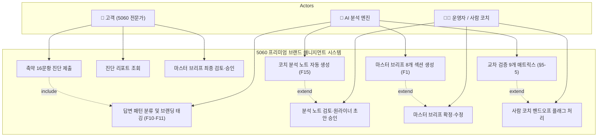

---

## 3. System Context and Interfaces

### 3.1 External Systems

| 외부 시스템 | 연동 방식 | 역할 |
| :--- | :--- | :--- |
| **Claude API (Anthropic)** | HTTPS REST API (POST /v1/messages) | LLM 추론 — 패턴 분류, 코칭 피드백, 마스터 브리프, 원라이너 초안 생성 |
| **Supabase** | PostgreSQL + JSONB, Supabase Client SDK | 리드 DB, 프로젝트·브랜드 프로필·ANSWER_OUTPUT 저장 |
| **GA4 (Google Analytics 4)** | JavaScript SDK | 진단 완료율, CTA 클릭율, 퍼널 분석 |
| **Typeform** | Webhook + REST API | NPS 설문 발송 및 응답 수집 |
| **UptimeRobot** | 외부 핑 모니터링 | 99.9% 가용성 감시 |
| **Datadog / Sentry** | SDK 삽입 | API Latency, 에러율 모니터링 및 Slack 알림 |

### 3.2 Client Applications & Component Diagram *(GAP-002 보완)*

| 클라이언트 | 기술 스택 | 대상 사용자 |
| :--- | :--- | :--- |
| **랜딩페이지 + 진단 폼** | Next.js (웹) | 고객 (5060 전문가) |
| **진단 리포트 웹뷰** | Next.js (웹) | 고객 |
| **관리자 콘솔** | Next.js 또는 Retool (웹) | 운영자·코치 |

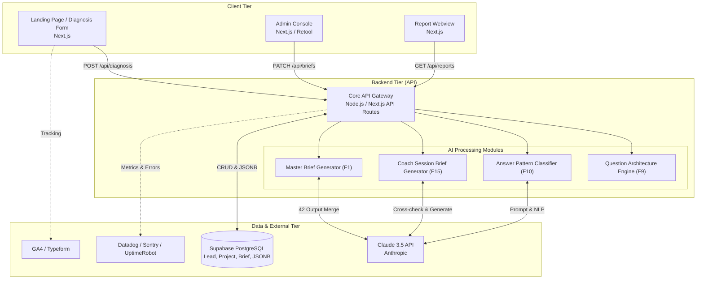

### 3.3 API Overview

| API 분류 | Endpoint (경로) | Method | 호출 주체 | 설명 |
| :--- | :--- | :---: | :--- | :--- |
| 진단 제출 | `/api/diagnosis/submit` | POST | 클라이언트 (고객) | 12~16문항 답변 제출, DIAGNOSIS 저장, 리포트 생성 트리거 |
| 리드 생성 | `/api/leads` | POST | 클라이언트 (고객) | 리드 정보 등록 |
| 리포트 조회 | `/api/reports/{diagnosis_id}` | GET | 클라이언트 (고객) | 진단 리포트 웹뷰 조회 |
| 패턴 분류 | `/api/ai/classify-patterns` | POST | 관리자 콘솔 | F10 — 답변 입력 → 패턴 분류 결과 반환 |
| 브랜딩 매핑 | `/api/ai/map-branding` | POST | 관리자 콘솔 | F11 — 패턴 결과 → 8개 브랜딩 요소 매핑 |
| 코치 분석 노트 | `/api/ai/coach-brief` | POST | 시스템 자동 트리거 | F15 — Stage 1·3 제출 시 자동 호출 |
| 마스터 브리프 생성 | `/api/ai/master-brief` | POST | 시스템 자동 트리거 (Q42) | F1 — 42 OUTPUT 변수 → 8개 섹션 생성 |
| 브리프 검수 | `/api/briefs/{id}/review` | PATCH | 관리자 콘솔 (검수자) | 승인·수정·거부 처리 |
| 브리프 조회 | `/api/briefs/{id}` | GET | 관리자 콘솔 | 코치 분석 노트 포함 조회 |
| 프로젝트 목록 | `/api/admin/projects` | GET | 관리자 콘솔 | 전체 프로젝트 현황 목록 |
| 고객 대시보드 | `/api/clients/{id}/dashboard` | GET | 클라이언트 | F5 — V1.5 이후 |

### 3.4 Interaction Sequences (핵심 시퀀스 다이어그램 — 5개)

> **편집 노트 (v1.1):** 기존 6개 중 "LLM API 타임아웃 흐름"은 §6.7 예외 처리 섹션으로 이동. 핵심 5개를 유지한다.

#### 시퀀스 1: 고객 축약 진단 → 리포트 → CTA 흐름

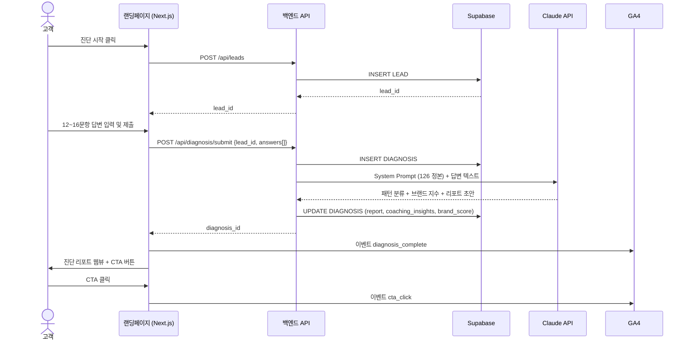

#### 시퀀스 2: F15 코치 분석 노트 자동 생성 흐름 (Stage 1)

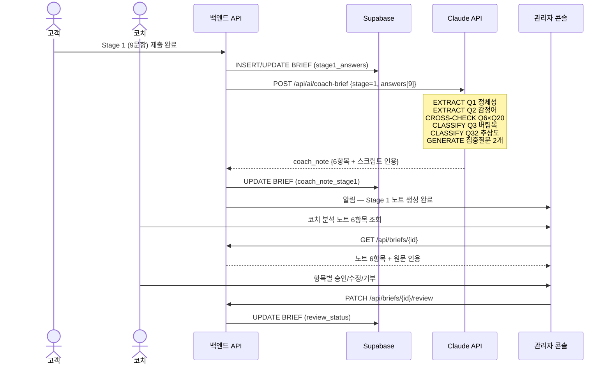

#### 시퀀스 3: Q42 자동 트리거 → 마스터 브리프 생성 흐름

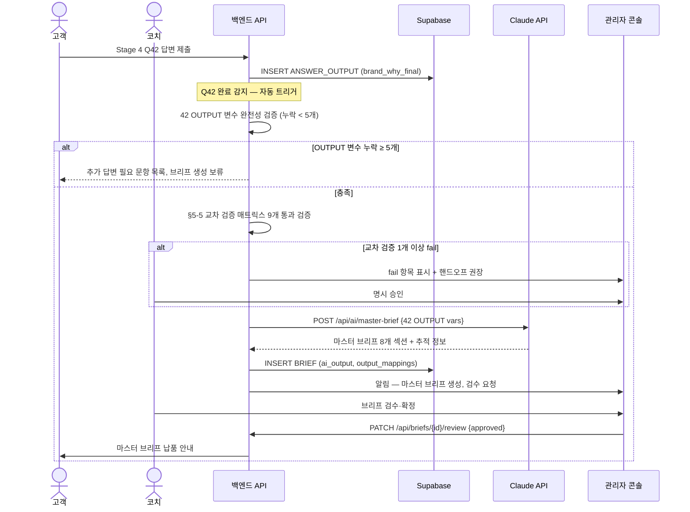

#### 시퀀스 4: Stage 3 제출 → 원라이너 3종 생성 → 2차 세션 준비 흐름

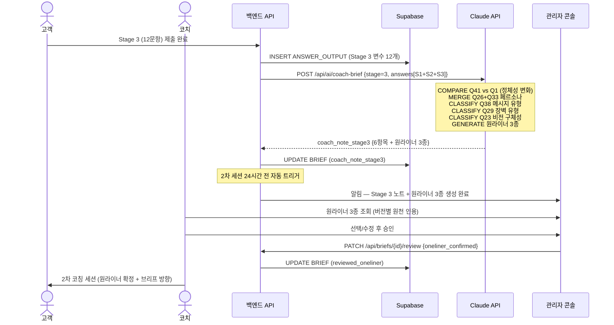

#### 시퀀스 5: 교차 검증 매트릭스 처리 흐름

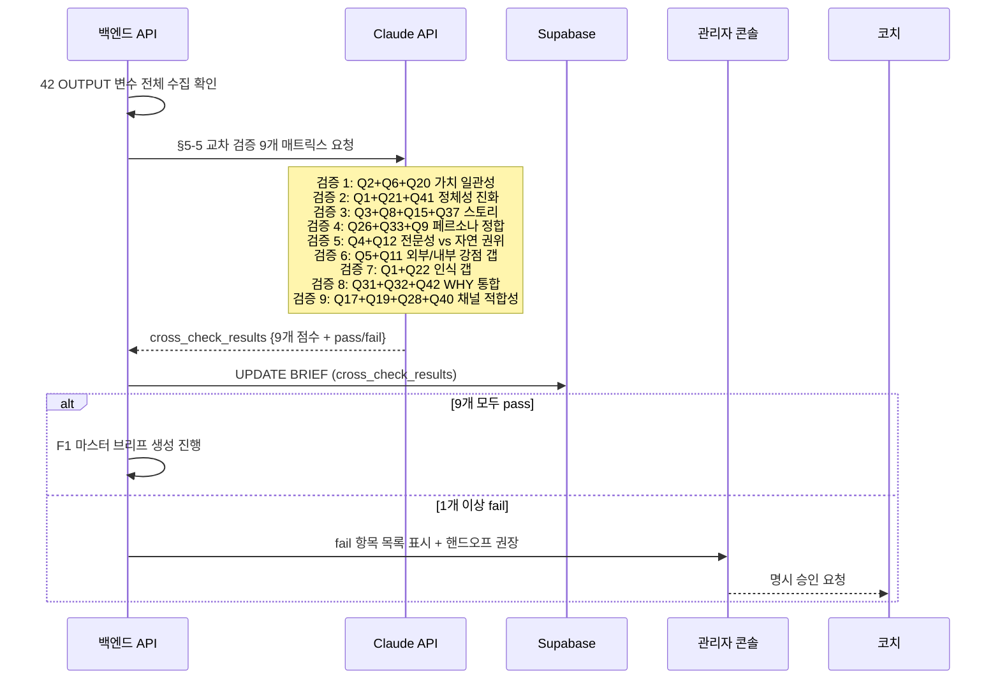

---

## 4. Specific Requirements

### 4.1 Functional Requirements

#### F1 — AI 마스터 브리프 생성기

| REQ-ID | 요구사항 설명 | Source | Priority | Acceptance Criteria |
| :--- | :--- | :--- | :---: | :--- |
| **REQ-FUNC-001** | Q42(`brand_why_final`) 저장 완료 시 5초 이내에 F1 마스터 브리프 생성기를 자동 호출해야 한다. | F1, §5-4-5, AC-Logic-5 | Must | **Given** Q42 OUTPUT 변수 저장 **When** Q42 완료 감지 **Then** 5초 이내 `/api/ai/master-brief` 자동 호출. 성공률 **100%**, 변수 전달 완전성 **100%** |
| **REQ-FUNC-002** | 마스터 브리프 생성기는 42개 OUTPUT 변수를 입력으로 받아 8개 섹션을 각 1건 이상 생성해야 한다. | F1, AC-Out-1 | Must | **Given** 20문항 이상 응답 + 매핑 완료 **When** 생성 완료 **Then** 8개 섹션 생성률 **100%** |
| **REQ-FUNC-003** | 마스터 브리프 각 섹션은 원천 답변 추적 정보(질문 번호·답변 일부 인용·Stage 표시)를 포함해야 한다. | US-6, AC-Out-4 | Must | **Given** 브리프 8개 섹션 생성 완료 **When** 고객 검토 **Then** 추적성 **100%**, 인용 정확도 **100%** |
| **REQ-FUNC-004** | AI 코칭 해석 메모의 일반론·뻔한 조언 비율은 검수자 태깅 기준 10% 미만이어야 한다. | F1, AC-Out-3 | Must | **Given** 브리프 생성 완료 **When** 검수자 검토 **Then** 일반론 비율 < **10%** |
| **REQ-FUNC-005** | F1 마스터 브리프 생성 전 §5-5 교차 검증 매트릭스 9개를 통과해야 하며 1개 이상 fail 시 검수자 명시 승인 또는 핸드오프를 자동 권장한다. | AC-Neg-6 | Must | **Given** 교차 검증 1개 이상 fail **When** 브리프 생성 시도 **Then** fail 항목 표시 + 핸드오프 권장. 검수자 명시 승인 없이 생성 진입 불가 |
| **REQ-FUNC-006** | 마스터 브리프 검토 시 고객이 "내 핵심을 정확히 짚었다"고 동의하는 비율을 측정해야 하며 목표 동의율은 85% 이상이어야 한다. *(GAP-006 신설)* | AC-Out-2 | Must | **Given** 브리프 생성 완료 **When** 고객 검토 설문 응답 **Then** "내 핵심을 정확히 짚었다" 동의율 ≥ **85%** |

---

#### F2 — AI 브랜드 진단 툴

| REQ-ID | 요구사항 설명 | Source | Priority | Acceptance Criteria |
| :--- | :--- | :--- | :---: | :--- |
| **REQ-FUNC-010** | 축약 16문항(Q1·Q2·Q4·Q6·Q7·Q8·Q9·Q11·Q13·Q15·Q26·Q28·Q33·Q40·Q41·Q42)을 PART 1→4 순서대로 표시하는 웹 진단 폼을 제공해야 한다. | F2, §4-4 | Must | **Given** 고객이 진단 폼 접근 **When** 폼 렌더링 **Then** 16문항이 순서대로 표시. 순서 오류 **0건** |
| **REQ-FUNC-011** | 진단 폼의 각 질문에 "이 답변이 어디에 쓰이는지" 브랜드 자산 매핑 안내 문구가 표시되어야 한다. | US-1, AC-Map-1, E7 | Must | **Given** 고객 진단 폼 진행 **When** 각 질문 표시 **Then** 브랜드 자산 매핑 안내 표시. 안내 그룹 완주율 미표시 대비 **+15%p** (E7 기준) |
| **REQ-FUNC-012** | 진단 완료 시 30초 이내에 브랜드 지수·약점·강점 리포트를 생성하고 프리미엄 매니지먼트 상담 CTA 버튼을 표시해야 한다. | F2, §11-3 | Must | **Given** 12문항 이상 응답 완료 **When** 진단 제출 **Then** 30초 이내 리포트 화면 표시 + CTA 노출. 클릭율 목표 ≥ **10%** |
| **REQ-FUNC-013** | 주관식 문항에 최소 단어수 3개 미만 또는 무의미한 텍스트 입력 시 클라이언트 단에서 유효성 검사 실패를 표시하고 서버 전송을 차단해야 한다. | AC-Neg-3 | Must | **Given** 3단어 미만 또는 특수문자만 입력 **When** 제출 버튼 클릭 **Then** 차단율 **100%**, 서버 전송 없음 |

---

#### F3 — 관리자 콘솔

| REQ-ID | 요구사항 설명 | Source | Priority | Acceptance Criteria |
| :--- | :--- | :--- | :---: | :--- |
| **REQ-FUNC-020** | 관리자 콘솔은 코치 분석 노트 6항목을 한 화면에 표시하며 각 항목별 원문 인용과 수정·승인 버튼을 제공해야 한다. | US-2, AC-Sess-2 | Must | **Given** Stage 1 코치 분석 노트 생성 완료 **When** 코치가 콘솔 조회 **Then** 6개 항목 모두 한 화면 표시 + 원문 인용 + 수정·승인 버튼. 화면 표시 정확도 **100%** |
| **REQ-FUNC-021** | 검수자가 환각 문장을 "거부(Reject)" 태깅하면 해당 브리프 생성을 즉각 보류 처리해야 한다. | AC-Neg-2 | Must | **Given** 환각 텍스트 포함 **When** 검수자 거부 태깅 **Then** 브리프 생성 즉각 보류. 환각 비율 유지 목표 < **5%** |
| **REQ-FUNC-022** | 고객 미승인 상태의 최종 리포트 외부 전송 시도를 자동 차단해야 한다. | §9-3 | Must | **Given** 고객 미승인 상태에서 외부 전송 시도 **When** 전송 버튼 클릭 **Then** 자동 차단 + 경고 메시지. 차단율 **100%** |
| **REQ-FUNC-023** | 운영자 1인이 월 6건 병렬 처리할 수 있도록 프로젝트별 현황(Stage·상태·최근 활동)을 단일 화면에 표시해야 한다. | F3 | Must | **Given** 운영자 콘솔 접속 **When** 프로젝트 목록 조회 **Then** 최대 6건 프로젝트 현황 표시. 표시 오류 **0건** |

---

#### F4 — 리드 DB

| REQ-ID | 요구사항 설명 | Source | Priority | Acceptance Criteria |
| :--- | :--- | :--- | :---: | :--- |
| **REQ-FUNC-030** | 진단 응답자 정보(이름·전화·이메일·채널·상태)를 Supabase LEAD 테이블에 자동 적재해야 한다. | F4 | Must | **Given** 고객이 리드 정보 입력 완료 **When** 제출 **Then** LEAD INSERT 성공. 데이터 누락률 **0%** |
| **REQ-FUNC-031** | 브리프 납품 완료 후 7일 경과 시 고객에게 5점 척도 팔로업 설문을 자동 발송해야 한다. | AC-Out-6 | Should | **Given** 납품 완료 후 7일 경과 **When** 자동 트리거 **Then** 설문 발송. 응답률 ≥ **70%**, 평균 점수 ≥ **4.0/5.0** |

---

#### F9 — Question Architecture Engine

| REQ-ID | 요구사항 설명 | Source | Priority | Acceptance Criteria |
| :--- | :--- | :--- | :---: | :--- |
| **REQ-FUNC-040** | 42문항 각각에 PART(1~4)·Stage(1~4)·브랜딩 요소·질문 의도·연결 산출물·MVP 포함 여부를 메타데이터로 관리해야 한다. | F9, §4-1, §4-2 | Must | **Given** 질문 메타데이터 조회 **When** API 호출 **Then** 42개 질문 전체 항목 반환. 누락 항목 **0건** |
| **REQ-FUNC-041** | MVP 축약 진단(16문항)에서도 PART 1→4 순서를 유지하며 각 파트 핵심 문항만 선별 표시해야 한다. | §4-5 | Must | **Given** MVP 진단 폼 접근 **When** 렌더링 **Then** 16문항 지정 순서 표시. 순서 오류 **0건** |

---

#### F10 — Answer Pattern Classifier

| REQ-ID | 요구사항 설명 | Source | Priority | Acceptance Criteria |
| :--- | :--- | :--- | :---: | :--- |
| **REQ-FUNC-050** | 고객 답변을 P1~P10 10개 유형으로 분류해야 한다. | F10, §5-1 | Must | **Given** 답변 텍스트 입력 **When** F10 분류 **Then** P1~P10 중 1개 이상 라벨 반환. 분류 정확도 ≥ **85%** |
| **REQ-FUNC-051** | Q1 답변에서 직함·직위 중심 표현 2회 이상 + 가치·태도 형용사 0개 감지 시 P1(직함 중심형) 분류 및 후속 질문을 자동 생성해야 한다. | AC-Pat-1 | Must | **Given** Q1에 직함 중심 답변 **When** AI 분석 **Then** P1 분류 + 후속 질문 생성. 분류 정확도 ≥ **85%**, 검수자 동의율 ≥ **80%** |
| **REQ-FUNC-052** | Q2·Q7 답변에서 자기축소 표현("별로"·"당연한"·"그냥" 등) 3회 이상 감지 시 P3(자기축소형) 분류 및 재프레이밍 메시지를 자동 생성해야 한다. | AC-Pat-2 | Must | **Given** Q2·Q7에 자기축소 표현 ≥ 3회 **When** AI 분석 **Then** P3 분류 + 재프레이밍. 감지 정밀도 ≥ **80%** |
| **REQ-FUNC-053** | Q9·Q26 답변에서 범용 표현 + 구체 페르소나 0개 감지 시 P5(타깃 과확장형) 분류 및 좁히기 코칭 질문을 자동 생성해야 한다. | AC-Pat-3 | Must | **Given** Q9·Q26에 범용 표현 + 구체 페르소나 0개 **When** AI 분석 **Then** P5 분류 + 좁히기 질문. 감지 정밀도 ≥ **85%** |
| **REQ-FUNC-054** | Q15 답변 < 50자 OR "없다"/"모르겠다"/"그냥 버텼다" 포함 시 P10(실패 회피형) 분류, 대안 질문 제공, "사람 코치 개입 권장" 플래그를 자동 설정해야 한다. | AC-Pat-4 | Must | **Given** Q15 답변 < 50자 OR 회피 표현 **When** AI 분석 **Then** P10 분류 + 대안 질문 + 코치 플래그. 감지 정밀도 ≥ **80%** |
| **REQ-FUNC-055** | CLASSIFY 동사를 포함한 15문항 처리 시 사전 정의 유형 집합 외 분류 결과 발생률이 0%여야 한다. | AC-Logic-3 | Must | **Given** CLASSIFY 대상 15문항 입력 **When** AI 분류 **Then** 사전 정의 유형 집합 외 결과 발생률 **0%** |
| **REQ-FUNC-056** | 동일 답변 텍스트를 3회 반복 실행 시 핵심 필드(태그·분류·키워드 TOP3) 일관성이 80% 이상이어야 한다. | AC-Logic-6 | Must | **Given** 동일 답변 입력 3회 반복 **When** F10·F12·F15 처리 **Then** 핵심 필드 일관성 ≥ **80%** |
| **REQ-FUNC-057** | Q4 답변에서 "당연한 거 아닌가요" 표현 또는 직업 나열만 감지 시 "전문성 마스터리 과소평가" 패턴으로 분류하고 재프레이밍 코칭 메시지를 생성해야 한다. *(GAP-001 신설)* | AC-Pat-5 | Must | **Given** Q4에 "당연한 거 아닌가요" 또는 직업 나열만 **When** AI 분석 **Then** 과소평가 패턴 분류 + 재프레이밍 메시지 *"그게 당연한 사람이 얼마나 될 것 같으세요?"* 생성. 감지 정밀도 ≥ **80%** |
| **REQ-FUNC-058** | Q35 답변에서 "모르겠다" 또는 경력 연수("30년 경력")만 제시 시 "차별점 인식 부족" 패턴으로 분류하고 역방향 질문을 생성해야 한다. *(GAP-001 신설)* | AC-Pat-6 | Must | **Given** Q35에 "모르겠다" 또는 경력 연수만 **When** AI 분석 **Then** 차별점 인식 부족 패턴 + 역방향 질문 *"그 분야에서 흔한 방식 중 가장 동의 안 되는 것이 있나요?"* 생성. 감지 정밀도 ≥ **80%** |
| **REQ-FUNC-059** | Q24 답변이 현재 직업의 단순 연장이거나 과도하게 추상적이면 "제2챕터 미설계" 패턴으로 분류하고 보완 질문을 생성해야 한다. *(GAP-001 신설)* | AC-Pat-7 | Should | **Given** Q24 답변이 현재 직업 연장 또는 추상적 **When** AI 분석 **Then** 제2챕터 미설계 패턴 + 보완 질문 *"지금 하는 일의 연장이 아니라 완전히 새롭게 한다면?"* 생성. 감지 정밀도 ≥ **75%** |

---

#### F11 — Branding Output Mapper

| REQ-ID | 요구사항 설명 | Source | Priority | Acceptance Criteria |
| :--- | :--- | :--- | :---: | :--- |
| **REQ-FUNC-060** | 각 답변을 8개 브랜딩 구성 요소(정체성·핵심 가치·강점·스토리·이상적 고객·핵심 메시지·채널 전략·레거시) 중 하나 이상에 매핑해야 한다. | F11, AC-Map-1 | Must | **Given** 20문항 이상 응답 **When** 브리프 생성 요청 **Then** 매핑률 ≥ **90%** |
| **REQ-FUNC-061** | 특정 브랜딩 구성 요소에 매핑된 답변이 0건이면 해당 영역 보완 질문을 자동 생성해야 한다. | AC-Map-2 | Must | **Given** 특정 요소 매핑 0건 **When** 브리프 생성 전 검증 **Then** 보완 질문 자동 생성. 생성률 **100%** |
| **REQ-FUNC-062** | Q26(심리통계)과 Q33(인구통계) 답변을 통합한 페르소나 카드 1종을 자동 생성해야 한다. | AC-Map-4 | Must | **Given** Q26·Q33 답변 모두 수신 **When** AI 분석 **Then** 페르소나 카드 생성. 통합 정확도 ≥ **85%**, 코치 동의율 ≥ **80%** |
| **REQ-FUNC-063** | Q38 답변이 "이렇게 해라"형 방법론 메시지로 감지되면 "방법론형 메시지" 패턴으로 분류하고 관점 전환 질문을 생성해야 한다. *(GAP-001 신설)* | AC-Pat-8 | Must | **Given** Q38 답변이 방법론형 **When** AI 분석 **Then** 방법론형 메시지 패턴 + 관점 전환 질문 *"그 메시지를 '이렇게 봐라' 형태로 바꾼다면?"* 생성. 감지 정밀도 ≥ **80%** |

---

#### F15 — Coach Session Brief Generator

| REQ-ID | 요구사항 설명 | Source | Priority | Acceptance Criteria |
| :--- | :--- | :--- | :---: | :--- |
| **REQ-FUNC-070** | Stage 1(9문항) 제출 완료 시 코치 분석 노트 6항목(① Q1 정체성 분류 ② Q2 감정어 추출 ③ Q6×Q20 가치 일관성 점수 ④ Q3 버팀목 분류 ⑤ Q32 추상도 평가 ⑥ 1차 세션 집중 질문 2개)을 자동 생성해야 한다. | US-2, AC-Sess-1 | Must | **Given** Stage 1 제출 완료 **When** AI 분석 완료 **Then** 6개 항목 생성률 **100%**, 코치 동의율 ≥ **85%** |
| **REQ-FUNC-071** | Stage 3(12문항) 제출 완료 시 코치 분석 노트 6항목(① Q41 vs Q1 변화 ② Q26+Q33 페르소나 ③ Q38 메시지 유형 ④ Q29 장벽 유형 ⑤ Q23 비전 구체성 ⑥ 원라이너 초안 3종)을 자동 생성해야 한다. | AC-Sess-3 | Must | **Given** Stage 3 제출 완료 **When** AI 분석 완료 **Then** 코치 동의율 ≥ **85%**, 원라이너 3종 생성률 **100%** |
| **REQ-FUNC-072** | 5060 특화 신호(직함 의존·자기축소·실패 회피·타깃 과확장 등) 1건 이상 감지 시 126 정본 기준 실제 발언 스크립트를 코치 분석 노트에 첨부해야 한다. | US-3, AC-Sess-4 | Must | **Given** 5060 특화 신호 ≥ 1건 감지 **When** 노트 생성 **Then** 스크립트 첨부율 **100%** |
| **REQ-FUNC-073** | Stage 1+2+3 데이터 통합 기반으로 2차 세션 24시간 전 원라이너 초안 3종(전문성형·공감형·결과형)을 자동 생성해야 한다. | US-5, AC-One-1 | Must | **Given** Stage 1·2·3 데이터 통합 **When** 2차 세션 24시간 전 트리거 **Then** 3종 생성률 **100%**, 코치 채택률 ≥ **70%** |
| **REQ-FUNC-074** | 원라이너 초안 각 버전 옆에 원천 답변 인용(Q 번호 + 표현 출처)을 표시해야 한다. | AC-One-2 | Must | **Given** 원라이너 3종 생성 완료 **When** 코치 검수 **Then** 인용 정확도 **100%** |
| **REQ-FUNC-075** | 코치 요청 시 원라이너 초안의 10글자 이하 압축 버전을 추가 생성해야 한다. | AC-One-3 | Should | **Given** 단순화 옵션 활성화 **When** 코치 요청 **Then** 압축 생성률 **100%**, 의미 보존율 ≥ **80%** |
| **REQ-FUNC-076** | Stage 1 코치 분석 노트 생성 최소 조건(6문항 이상)을 미충족 시 차단 메시지와 미응답 목록을 표시해야 한다. | AC-Neg-4 | Must | **Given** Stage 1 응답 < 6문항 **When** 노트 생성 시도 **Then** 차단 + 미응답 목록 표시. 차단 정확도 **100%** |
| **REQ-FUNC-077** | MERGE/GENERATE 대상 4문항(Q9·Q21·Q41·Q42) 처리 결과는 다른 OUTPUT 변수들을 실제로 참조하여 생성해야 한다. | AC-Logic-7 | Must | **Given** GENERATE/MERGE 대상 문항 처리 **When** AI 처리 **Then** 다중 변수 참조율 **100%**, 검수자 평가 ≥ **4.0/5.0** |
| **REQ-FUNC-078** | 원라이너 초안 3종이 모두 가치 일관성 점수 0.5 미만이면 "원천 데이터 부족" 경고와 보완 질문을 자동 제안해야 한다. *(GAP-005 신설)* | AC-One-4 | Should | **Given** 원라이너 3종 일관성 점수 모두 < 0.5 **When** 검수 단계 **Then** "원천 데이터 부족" 경고 + 보완 질문 자동 제안. 경고 적합성 ≥ **85%** |

---

#### 답변 충분성 요구사항

| REQ-ID | 요구사항 설명 | Source | Priority | Acceptance Criteria |
| :--- | :--- | :--- | :---: | :--- |
| **REQ-FUNC-080** | 응답 문항 20개 미만 시 마스터 브리프 생성을 차단하고 "응답 부족(최소 20문항 필요)" 경고를 출력해야 한다. | AC-Suf-1 | Must | **Given** 20문항 미만 응답 **When** 브리프 생성 요청 **Then** 차단 정확도 **100%** |
| **REQ-FUNC-081** | 응답 문항의 평균 답변 길이 < 100자 시 "답변 보충 필요" 알림과 해당 문항 목록을 표시해야 한다. | AC-Suf-2 | Must | **Given** 평균 답변 < 100자 **When** AI 분석 시작 **Then** 알림 + 목록 표시. 식별 정확도 ≥ **95%** |
| **REQ-FUNC-082** | Q42 자동 트리거 시 OUTPUT 변수 누락 ≥ 5개이면 브리프 생성을 보류하고 추가 답변 필요 문항 목록을 표시해야 한다. | AC-Neg-7 | Must | **Given** Q42 트리거 시 OUTPUT 누락 ≥ 5개 **When** F1 호출 **Then** 생성 보류 + 목록 표시. 누락 검출 정확도 **100%** |
| **REQ-FUNC-083** | 특정 질문에서 핵심 키워드가 0개로 추출되면 해당 문항에 대해 보완 질문 1~2개를 자동 생성해야 한다. *(GAP-004 신설)* | AC-Suf-3 | Must | **Given** 특정 질문 핵심 키워드 추출 0개 **When** AI 분석 **Then** 보완 질문 1~2개 자동 생성. 보완 질문 적합도 ≥ **85%** |

---

#### 교차 분석 요구사항

| REQ-ID | 요구사항 설명 | Source | Priority | Acceptance Criteria |
| :--- | :--- | :--- | :---: | :--- |
| **REQ-FUNC-090** | Q1과 Q41 답변이 모두 수신되면 정체성 표현 변화 리포트(직함 의존 비율 변화·가치 표현 추가·어휘 구체성·코칭 변화 요약)를 자동 생성해야 한다. | US-4, AC-Cross-1 | Must | **Given** Q1 + Q41 모두 수신 **When** AI 분석 **Then** 4개 지표 포함 변화 리포트. 변화량 정확도 ≥ **90%** |
| **REQ-FUNC-091** | Q6·Q20 교차 검증으로 가치 일관성 점수(0~1)를 산출하고 0.5 미만 시 "심화 탐색 필요" 플래그와 코치 알림을 자동 설정해야 한다. | AC-Cross-2 | Must | **Given** Q6·Q20 답변 수신 **When** AI 분석 **Then** 점수 산출. < 0.5 시 플래그 + 코치 알림. 점수 정확도 ≥ **85%** |
| **REQ-FUNC-092** | Q1·Q21·Q41 3지점 정체성 일관성 점수를 계산하고 정체성 진화 시각화(Stage 1→2→3)를 생성해야 한다. | AC-Cross-3 | Should | **Given** Q1·Q21·Q41 모두 수신 **When** AI 분석 **Then** 3지점 일관성 점수 + 진화 시각화. 점수 정확도 ≥ **85%** |
| **REQ-FUNC-093** | Q32·Q42 답변의 추상도 차이가 2단계를 초과하면 "WHY 재확인 필요" 플래그를 자동 설정해야 한다. | AC-Cross-4 | Should | **Given** Q32·Q42 답변 수신 **When** AI 분석 **Then** 추상도 차이 > 2단계 시 플래그. 검출 정밀도 ≥ **80%** |

---

#### AI 처리 로직 정확도 요구사항

| REQ-ID | 요구사항 설명 | Source | Priority | Acceptance Criteria |
| :--- | :--- | :--- | :---: | :--- |
| **REQ-FUNC-100** | 42문항 처리 시 §10-3의 표준 OUTPUT 변수(42종)가 스키마에 일치하여 누락 없이 생성되어야 한다. | AC-Logic-1 | Must | **Given** 42문항 답변 입력 **When** F1·F15 처리 **Then** 변수 생성률 ≥ **95%**, 스키마 일치율 **100%** |
| **REQ-FUNC-101** | EXTRACT 동사를 포함한 **17문항**에서 추출된 키워드·감정어는 답변 텍스트의 실제 표현에 근거해야 하며 환각을 포함하지 않아야 한다. *(GAP-008 수정: 15→17문항)* | AC-Logic-2 | Must | **Given** EXTRACT 대상 17문항 입력 **When** AI 처리 **Then** 환각률 < **5%**, 검수자 동의율 ≥ **85%** |
| **REQ-FUNC-102** | §5-5 교차 검증 매트릭스 9개 항목에 대한 정합성 점수(0~1)를 산출해야 한다. | AC-Logic-4 | Must | **Given** CROSS-CHECK 대상 문항 조합 입력 **When** AI 교차 검증 **Then** 9개 중 해당 결과(통과/fail) + 점수 반환. 정확도 ≥ **85%** |

---

#### 오류 처리 요구사항

| REQ-ID | 요구사항 설명 | Source | Priority | Acceptance Criteria |
| :--- | :--- | :--- | :---: | :--- |
| **REQ-FUNC-110** | LLM API 호출 응답 30초 초과 또는 500 에러 시 최대 2회 자동 재시도 후 실패 시 "AI 분석 지연 중, 최대 5분 소요" 안내 배너를 표시해야 한다. | AC-Neg-1 | Must | **Given** LLM API > 30,000ms 또는 500 에러 **When** 호출 **Then** 2회 재시도. 재시도 성공률 ≥ **90%**. 실패 시 안내 배너 |
| **REQ-FUNC-111** | 원라이너 3종이 의미적으로 모두 동일(중복)할 경우 자동 재생성 요청과 코치에게 "원천 답변 다양성 부족" 알림을 발송해야 한다. | AC-Neg-5 | Must | **Given** 원라이너 3종 모두 의미 중복 **When** 검수 단계 **Then** 재생성 + 코치 알림. 중복 검출 정확도 ≥ **90%** |
| **REQ-FUNC-112** | 가치 일관성 점수 < 0.5 또는 사람 코치 권장 플래그 ≥ 3건이면 "사람 코치 핸드오프 권장" 안내와 추가 코칭 세션 CTA를 자동 표시해야 한다. *(GAP-007 신설)* | AC-Out-5 | Must | **Given** 가치 일관성 점수 < 0.5 OR 코치 권장 플래그 ≥ 3건 **When** 시스템 검증 단계 **Then** 핸드오프 안내 표시율 **100%**, 핸드오프 적합도 ≥ **85%** |

---

### 4.2 Non-Functional Requirements

#### 성능 (Performance)

| REQ-ID | 요구사항 설명 | Source | Priority | 측정 기준 |
| :--- | :--- | :--- | :---: | :--- |
| **REQ-NF-001** | 일반 API 응답 시간 P95 < 200ms | §9-7 | Must | Datadog P95. 2분간 초과 시 Slack Warning |
| **REQ-NF-002** | LLM 추론 API 응답 시간 P95 < 25초 | §9-7 | Must | Datadog P95. 2분간 초과 시 Slack Warning |
| **REQ-NF-003** | 진단 폼 동시 100명 입력 지연 없음 | §9-7 | Must | K6 부하 테스트 (런칭 전 수행) |
| **REQ-NF-004** | 진단 결과 리포트 동시 500명 조회 P95 500ms 이하 | §9-7 | Must | K6 부하 테스트 |
| **REQ-NF-005** | Q42 완료 → F1 자동 호출 5초 이내 완료 | AC-Logic-5 | Must | API 호출 타임스탬프 (`briefs.created_at`) |
| **REQ-NF-006** | 마스터 브리프 초안 생성 소요시간 ≤ 30분/건 (보조 KPI 1) | §1-3 보조 KPI 1 | Must | `briefs.created_at` 타임스탬프 기준 |

#### 가용성 (Availability)

| REQ-ID | 요구사항 설명 | Source | Priority | 측정 기준 |
| :--- | :--- | :--- | :---: | :--- |
| **REQ-NF-010** | 핵심 시스템 월간 Uptime ≥ 99.9% (허용 장애 43.8분/월) | §9-7 | Must | UptimeRobot 1분 단위 핑. 다운타임 시 SMS 즉시 |
| **REQ-NF-011** | HTTP 5xx 에러 5분 내 5회 이상 스파이크 시 즉각 Slack Critical 알람 | §9-7 | Must | Datadog. 전체 API 에러율 < **1%** |

#### 보안 (Security)

| REQ-ID | 요구사항 설명 | Source | Priority | 측정 기준 |
| :--- | :--- | :--- | :---: | :--- |
| **REQ-NF-020** | 모든 API 통신 TLS 1.2 이상 암호화 | §9-3 | Must | SSL/TLS 인증서 유효성 정기 점검 |
| **REQ-NF-021** | 경력 서사·실패 경험·개인 신념 등 자기서사 데이터를 일반 개인정보와 별도 보호 등급으로 관리 | §9-3 | Must | Supabase RLS 정책 + 별도 필드 암호화 |
| **REQ-NF-022** | 고객 답변 데이터를 AI 학습용으로 재사용 금지 (별도 동의 필수) | §9-3, C8 | Must | Claude API 약관 준수 감사 로그 유지 |
| **REQ-NF-023** | 운영자·코치 기능은 RBAC로 관리자 콘솔 접근 제한 | §9-3 | Must | 역할별 API 엔드포인트 접근 권한 테스트 |
| **REQ-NF-024** | 고객 미승인 상태의 최종 리포트 외부 전송 시스템 차단 | §9-3 | Must | 차단율 **100%** 자동화 테스트 |

#### AI 코칭 품질 (AI Coaching Quality)

| REQ-ID | 요구사항 설명 | Source | Priority | 측정 기준 |
| :--- | :--- | :--- | :---: | :--- |
| **REQ-NF-030** | 답변 패턴 분류 정확도 ≥ 85% (검수자 기준) | §9-6 | Must | 검수자 월간 승인/거부 태깅 집계 |
| **REQ-NF-031** | 브랜드 요소 매핑 정확도 ≥ 90% | §9-6 | Must | 매핑-검수자 판단 일치율 월간 집계 |
| **REQ-NF-032** | AI 코칭 톤 적합도 ≥ 4.3/5.0 (5060 고객 평가) | §9-6 | Must | 브리프 검수 미팅 후 5점 척도 설문 |
| **REQ-NF-033** | 일반론·뻔한 조언 비율 < 10% (검수자 태깅 기준) | §9-6 | Must | "일반론" 태깅 문장 수 / 전체 코칭 문장 수 |
| **REQ-NF-034** | 자기축소 재프레이밍 성공률 ≥ 80% (고객 동의율) | §9-6 | Must | "AI 제시 재해석에 동의하십니까?" 설문 |
| **REQ-NF-035** | 최종 브랜드 문장 "바로 활용 가능" 응답 ≥ 80% | §9-6 | Must | 납품 후 "수정 없이 사용 가능합니까?" 설문 |
| **REQ-NF-036** | 환각(Hallucination) 비율 < 5% (전체 AI 출력 기준) | AC-Neg-2, AC-Logic-2 | Must | 검수자 "거부" 태깅 건수 / 전체 AI 출력 문장 수 |
| **REQ-NF-037** | 코치 분석 노트 6항목 적합도 ≥ 85% (코치 동의율) | §9-6 | Must | F15 출력 항목별 "수정 없이 사용 가능" 응답 비율 |
| **REQ-NF-038** | 원라이너 3종 코치 채택률 ≥ 70% | §9-6 | Must | 2차 세션에서 3종 중 1개 이상이 최종 기반이 된 비율 |
| **REQ-NF-039** | F15 사용 시 코치 세션 준비 시간 단축률 ≥ 75% | §9-6 | Must | F15 미사용(60분) vs 사용(≤ 15분) 측정 |

#### 비즈니스 KPI

| REQ-ID | KPI 분류 | 요구사항 설명 | Source | Priority | 측정 기준 |
| :--- | :--- | :--- | :--- | :---: | :--- |
| **REQ-NF-040** | Business Outcome | 고객 1인당 분기 B2B 수주 ≥ 2건 (북극성 KPI) | §1-3 북극성 | Must | Supabase `projects.outcome_count` 분기 집계 |
| **REQ-NF-041** | Business Outcome | Option B 전환율 ≥ 10%/월 | §1-3 보조 KPI 2 | Should | Supabase 조인 쿼리 월간 집계 |
| **REQ-NF-042** | Business Outcome | NPS ≥ 70 | §1-3 보조 KPI 3 | Should | Typeform NPS 설문 (프로젝트 종료 시) |
| **REQ-NF-043** | Business Outcome | 리테이너 전환율 ≥ 30%/분기 | §1-3 보조 KPI 4 | Should | Supabase `retainers` 분기 집계 |
| **REQ-NF-044** | Product Funnel | AI 진단 리포트 완독 → CTA 클릭율 ≥ 10%/주 | §1-3 보조 KPI 5 | Should | GA4 이벤트 `cta_click` / `diagnosis_complete` |
| **REQ-NF-045** | Product Funnel | 월간 신규 진단 리드 수 ≥ 50명 | §1-3 보조 KPI 6 | Should | Supabase `leads` 월간 INSERT |
| **REQ-NF-046** | AI Quality | 마스터 브리프 고객 "핵심 정확" 동의율 ≥ 85% | AC-Out-2 | Must | REQ-FUNC-006 측정 방법과 동일 |

#### 확장성 및 유지보수성

| REQ-ID | 요구사항 설명 | Source | Priority | 측정 기준 |
| :--- | :--- | :--- | :---: | :--- |
| **REQ-NF-050** | MVP 단계에서 ANSWER_OUTPUT은 Supabase JSONB 단일 필드로 저장하며 V1.5 전환 시 정형화 마이그레이션 가능 구조를 유지해야 한다. | §10-3, C2 | Must | JSONB 필드 내 42개 표준 변수명 일관성. 정규화 전환 스크립트 1주 내 작성 가능 |
| **REQ-NF-051** | Claude API System Prompt 업데이트(패턴 스크립트 교체)가 코드 배포 없이 설정 파일 변경으로 10분 이내 반영 가능해야 한다. | §9-6, C4 | Should | 설정 변경 후 재배포 없이 10분 이내 반영 확인 |

---

## 5. Traceability Matrix *(v1.1 — AC 단위 확장)*

| PRD Source Type | PRD ID | PRD 요약 | SRS REQ-ID | Test Case | 상태 |
| :--- | :--- | :--- | :--- | :--- | :--- |
| Story | US-1 | 질문별 브랜드 자산 매핑 안내 | REQ-FUNC-011 | TC-011 | Covered |
| Story | US-2 | Stage 1 코치 분석 노트 자동 생성 | REQ-FUNC-070, REQ-FUNC-020 | TC-070, TC-020 | Covered |
| Story | US-3 | 5060 특화 신호 감지 + 스크립트 사용 | REQ-FUNC-051~054, REQ-FUNC-057~059, REQ-FUNC-063, REQ-FUNC-072 | TC-051~059, TC-063, TC-072 | Covered |
| Story | US-4 | Stage 1→3 변화점 시각화 | REQ-FUNC-090 | TC-090 | Covered |
| Story | US-5 | 원라이너 초안 3종 자동 생성 | REQ-FUNC-073, REQ-FUNC-074, REQ-FUNC-075, REQ-FUNC-078 | TC-073~075, TC-078 | Covered |
| Story | US-6 | 마스터 브리프 원천 추적 | REQ-FUNC-003 | TC-003 | Covered |
| Story | US-7 | 답변 간 일관성 충돌 자동 감지 | REQ-FUNC-091~093 | TC-091~093 | Covered |
| Feature | F1 | AI 마스터 브리프 생성기 | REQ-FUNC-001~006, REQ-FUNC-100~102 | TC-001~006, TC-100~102 | Covered |
| Feature | F2 | AI 브랜드 진단 툴 | REQ-FUNC-010~013 | TC-010~013 | Covered |
| Feature | F3 | 관리자 콘솔 | REQ-FUNC-020~023 | TC-020~023 | Covered |
| Feature | F4 | 리드 DB | REQ-FUNC-030~031 | TC-030~031 | Covered |
| Feature | F9 | Question Architecture Engine | REQ-FUNC-040~041 | TC-040~041 | Covered |
| Feature | F10 | Answer Pattern Classifier | REQ-FUNC-050~059 | TC-050~059 | Covered |
| Feature | F11 | Branding Output Mapper | REQ-FUNC-060~063 | TC-060~063 | Covered |
| Feature | F15 | Coach Session Brief Generator | REQ-FUNC-070~078 | TC-070~078 | Covered |
| AC | AC-Suf-1 | 20문항 미만 시 브리프 생성 차단 | REQ-FUNC-080 | TC-080 | Covered |
| AC | AC-Suf-2 | 평균 답변 < 100자 시 알림 | REQ-FUNC-081 | TC-081 | Covered |
| AC | **AC-Suf-3** | 핵심 키워드 0개 시 보완 질문 생성 | **REQ-FUNC-083** | TC-083 | **Added v1.1** |
| AC | AC-Pat-1 | Q1 직함 중심형 감지 | REQ-FUNC-051 | TC-051 | Covered |
| AC | AC-Pat-2 | Q2·Q7 자기축소형 감지 | REQ-FUNC-052 | TC-052 | Covered |
| AC | AC-Pat-3 | Q9·Q26 타깃 과확장형 감지 | REQ-FUNC-053 | TC-053 | Covered |
| AC | AC-Pat-4 | Q15 실패 회피형 감지 | REQ-FUNC-054 | TC-054 | Covered |
| AC | **AC-Pat-5** | Q4 전문성 마스터리 과소평가 | **REQ-FUNC-057** | TC-057 | **Added v1.1** |
| AC | **AC-Pat-6** | Q35 차별점 인식 부족 | **REQ-FUNC-058** | TC-058 | **Added v1.1** |
| AC | **AC-Pat-7** | Q24 제2챕터 미설계 | **REQ-FUNC-059** | TC-059 | **Added v1.1** |
| AC | **AC-Pat-8** | Q38 방법론형 메시지 | **REQ-FUNC-063** | TC-063 | **Added v1.1** |
| AC | AC-Map-1 | 브랜드 요소 매핑률 ≥ 90% | REQ-FUNC-060 | TC-060 | Covered |
| AC | AC-Map-2 | 매핑 0건 시 보완 질문 생성 | REQ-FUNC-061 | TC-061 | Covered |
| AC | AC-Map-3 | Q1↔Q41 변화량 3지표 산출 | REQ-FUNC-090 | TC-090 | Covered |
| AC | AC-Map-4 | Q26+Q33 페르소나 카드 생성 | REQ-FUNC-062 | TC-062 | Covered |
| AC | AC-Sess-1 | Stage 1 코치 분석 노트 6항목 생성 | REQ-FUNC-070 | TC-070 | Covered |
| AC | AC-Sess-2 | 관리자 콘솔 노트 조회 표시 | REQ-FUNC-020 | TC-020 | Covered |
| AC | AC-Sess-3 | Stage 3 코치 분석 노트 6항목 생성 | REQ-FUNC-071 | TC-071 | Covered |
| AC | AC-Sess-4 | 5060 신호 감지 시 스크립트 첨부 | REQ-FUNC-072 | TC-072 | Covered |
| AC | AC-One-1 | 원라이너 초안 3종 자동 생성 | REQ-FUNC-073 | TC-073 | Covered |
| AC | AC-One-2 | 원라이너 원천 답변 인용 표시 | REQ-FUNC-074 | TC-074 | Covered |
| AC | AC-One-3 | 원라이너 10글자 이하 압축 생성 | REQ-FUNC-075 | TC-075 | Covered |
| AC | **AC-One-4** | 원라이너 3종 모두 일관성 < 0.5 시 경고 | **REQ-FUNC-078** | TC-078 | **Added v1.1** |
| AC | AC-Cross-1 | Q1↔Q41 정체성 변화 리포트 | REQ-FUNC-090 | TC-090 | Covered |
| AC | AC-Cross-2 | Q6×Q20 가치 일관성 점수 | REQ-FUNC-091 | TC-091 | Covered |
| AC | AC-Cross-3 | Q1·Q21·Q41 3지점 일관성 | REQ-FUNC-092 | TC-092 | Covered |
| AC | AC-Cross-4 | Q32·Q42 WHY 일관성 | REQ-FUNC-093 | TC-093 | Covered |
| AC | AC-Out-1 | 브리프 8개 섹션 생성 100% | REQ-FUNC-002 | TC-002 | Covered |
| AC | **AC-Out-2** | 고객 "핵심 정확" 동의율 ≥ 85% | **REQ-FUNC-006, REQ-NF-046** | TC-006, TC-NF-046 | **Added v1.1** |
| AC | AC-Out-3 | 일반론 비율 < 10% | REQ-FUNC-004, REQ-NF-033 | TC-004, TC-NF-033 | Covered |
| AC | AC-Out-4 | 브리프 섹션별 원천 추적 100% | REQ-FUNC-003 | TC-003 | Covered |
| AC | **AC-Out-5** | 가치 점수 < 0.5 OR 플래그 ≥ 3건 시 핸드오프 CTA | **REQ-FUNC-112** | TC-112 | **Added v1.1** |
| AC | AC-Out-6 | 납품 7일 후 팔로업 설문 자동 발송 | REQ-FUNC-031 | TC-031 | Covered |
| AC | AC-Neg-1 | LLM API 타임아웃 재시도 + 안내 배너 | REQ-FUNC-110 | TC-110 | Covered |
| AC | AC-Neg-2 | 환각 거부 태깅 시 브리프 생성 보류 | REQ-FUNC-021, REQ-NF-036 | TC-021, TC-NF-036 | Covered |
| AC | AC-Neg-3 | 무의미 입력 클라이언트 차단 | REQ-FUNC-013 | TC-013 | Covered |
| AC | AC-Neg-4 | Stage 1 최소 6문항 미충족 시 차단 | REQ-FUNC-076 | TC-076 | Covered |
| AC | AC-Neg-5 | 원라이너 3종 중복 감지 시 재생성 | REQ-FUNC-111 | TC-111 | Covered |
| AC | AC-Neg-6 | 교차 검증 fail 시 브리프 생성 게이트 | REQ-FUNC-005 | TC-005 | Covered |
| AC | AC-Neg-7 | OUTPUT 변수 누락 ≥ 5개 시 브리프 보류 | REQ-FUNC-082 | TC-082 | Covered |
| AC | AC-Logic-1 | 42 OUTPUT 변수 스키마 일치 생성 | REQ-FUNC-100 | TC-100 | Covered |
| AC | AC-Logic-2 | EXTRACT 17문항 환각 없음 | REQ-FUNC-101 | TC-101 | **Fixed v1.1 (17문항)** |
| AC | AC-Logic-3 | CLASSIFY 15문항 유형 집합 외 0% | REQ-FUNC-055 | TC-055 | Covered |
| AC | AC-Logic-4 | 교차 검증 정합성 점수 산출 | REQ-FUNC-102 | TC-102 | Covered |
| AC | AC-Logic-5 | Q42 → F1 5초 이내 자동 호출 | REQ-FUNC-001, REQ-NF-005 | TC-001, TC-NF-005 | Covered |
| AC | AC-Logic-6 | 핵심 필드 3회 반복 일관성 ≥ 80% | REQ-FUNC-056 | TC-056 | Covered |
| AC | AC-Logic-7 | MERGE/GENERATE 다중 변수 참조 100% | REQ-FUNC-077 | TC-077 | Covered |
| KPI | KPI-NS-1 | B2B 수주 ≥ 2건/분기 | REQ-NF-040 | TC-NF-040 | Covered |
| KPI | KPI-S-1~6 | 보조 KPI 6종 | REQ-NF-041~046 | TC-NF-041~046 | Covered |
| KPI | SYS-1 | 일반 API P95 < 200ms | REQ-NF-001 | TC-NF-001 | Covered |
| KPI | SYS-2~4 | LLM 응답·동시 접속·동시 조회 | REQ-NF-002~004 | TC-NF-002~004 | Covered |
| KPI | SYS-5 | Uptime 99.9% | REQ-NF-010 | TC-NF-010 | Covered |
| Experiment | E5 | AI-코치 분석 일치율 ≥ 80% | REQ-NF-030 | TC-NF-030 | Covered |
| Experiment | E6 | 12문항 CTA 클릭율 1.5배 | REQ-NF-044 | TC-NF-044 | Covered |
| Experiment | E7 | 안내 문구 포함 완주율 +15%p | REQ-FUNC-011 | TC-011 | Covered |
| Experiment | E8 | 패턴 기반 피드백 만족도 ≥ 4.3 | REQ-NF-032 | TC-NF-032 | Covered |
| Experiment | E9 | F15 코치 노트 동의율 ≥ 85%, 준비 시간 단축 ≥ 75% | REQ-NF-037, REQ-NF-039 | TC-NF-037, TC-NF-039 | Covered |
| Experiment | E10 | 원라이너 3종으로 2차 세션 시간 ≥ 50% 단축 | REQ-NF-038 | TC-NF-038 | Covered |
| Experiment | E11 | §5-4 의사 코드 스펙 OUTPUT 정확도 | REQ-FUNC-100~102, REQ-NF-036 | TC-100~102, TC-NF-036 | Covered |
| API | API-001 | POST /api/diagnosis/submit | REQ-FUNC-010, REQ-FUNC-012 | TC-API-001 | Covered |
| API | API-002 | POST /api/ai/coach-brief | REQ-FUNC-070~071 | TC-API-002 | Covered |
| API | API-003 | POST /api/ai/master-brief | REQ-FUNC-001~002 | TC-API-003 | Covered |

---

## 6. Appendix

### 6.1 API Endpoint List

| Method | Endpoint | 설명 | 요청 주체 | 관련 REQ-ID |
| :---: | :--- | :--- | :--- | :--- |
| POST | `/api/leads` | 리드 정보 등록 | 클라이언트 | REQ-FUNC-030 |
| POST | `/api/diagnosis/submit` | 12~16문항 답변 제출 + 리포트 생성 | 클라이언트 | REQ-FUNC-010, REQ-FUNC-012 |
| GET | `/api/reports/{diagnosis_id}` | 진단 리포트 웹뷰 조회 | 클라이언트 | REQ-FUNC-012 |
| POST | `/api/ai/classify-patterns` | F10 — 답변 패턴 분류 | 관리자 콘솔 | REQ-FUNC-050~059 |
| POST | `/api/ai/map-branding` | F11 — 브랜딩 요소 매핑 | 관리자 콘솔 | REQ-FUNC-060~063 |
| POST | `/api/ai/coach-brief` | F15 — Stage 1·3 코치 분석 노트 자동 생성 | 시스템 자동 트리거 | REQ-FUNC-070~078 |
| POST | `/api/ai/master-brief` | F1 — 42 OUTPUT → 마스터 브리프 8개 섹션 | 시스템 자동 트리거 (Q42) | REQ-FUNC-001~006 |
| PATCH | `/api/briefs/{id}/review` | 검수자 승인·수정·거부 | 관리자 콘솔 | REQ-FUNC-021, REQ-FUNC-022 |
| GET | `/api/briefs/{id}` | 브리프 + 코치 분석 노트 조회 | 관리자 콘솔 | REQ-FUNC-020 |
| GET | `/api/admin/projects` | 전체 프로젝트 현황 | 관리자 콘솔 | REQ-FUNC-023 |
| GET | `/api/clients/{id}/dashboard` | 고객 대시보드 (V1.5 이후) | 클라이언트 | F5 |

---

### 6.2 Entity & Data Model

#### ERD (Entity Relationship Diagram) *(GAP-002, GAP-003 보완)*

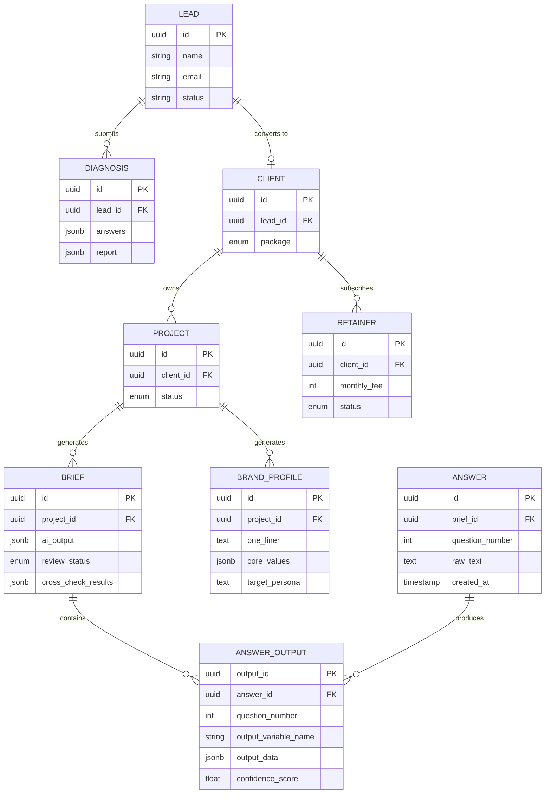

#### MVP 핵심 엔터티 상세 스키마

##### LEAD

| 컬럼명 | 타입 | 제약 | 설명 |
| :--- | :--- | :--- | :--- |
| `id` | UUID | PK | 리드 고유 식별자 |
| `name` | VARCHAR(100) | NOT NULL | 고객 이름 |
| `phone` | VARCHAR(20) | | 전화번호 |
| `email` | VARCHAR(255) | NOT NULL, UNIQUE | 이메일 |
| `title` | VARCHAR(200) | | 현재 직함·직위 |
| `company` | VARCHAR(200) | | 소속 기관·회사 |
| `channel` | VARCHAR(100) | | 유입 채널 (GA4 Source) |
| `status` | ENUM | NOT NULL | `new`, `contacted`, `consulting`, `contracted`, `completed` |
| `created_at` | TIMESTAMP | NOT NULL, DEFAULT NOW() | 등록 시각 |

##### DIAGNOSIS

| 컬럼명 | 타입 | 제약 | 설명 |
| :--- | :--- | :--- | :--- |
| `id` | UUID | PK | 진단 고유 식별자 |
| `lead_id` | UUID | FK → LEAD | 연결 리드 |
| `answers` | JSONB | NOT NULL | 12~16문항 답변 원문 배열 |
| `report` | JSONB | | AI 생성 진단 리포트 |
| `coaching_insights` | JSONB | | AI 코칭 인사이트 메모 |
| `brand_score` | FLOAT | | AI 산출 브랜드 지수 (0~100) |
| `created_at` | TIMESTAMP | NOT NULL | 진단 생성 시각 |

##### CLIENT

| 컬럼명 | 타입 | 제약 | 설명 |
| :--- | :--- | :--- | :--- |
| `id` | UUID | PK | |
| `lead_id` | UUID | FK → LEAD | 연결 리드 |
| `name` | VARCHAR(100) | NOT NULL | |
| `package` | ENUM | NOT NULL | `option_a`, `option_b`, `retainer` |
| `paid_amount` | INT | | 결제 금액 (원) |
| `contract_date` | DATE | | 계약일 |

##### PROJECT

| 컬럼명 | 타입 | 제약 | 설명 |
| :--- | :--- | :--- | :--- |
| `id` | UUID | PK | |
| `client_id` | UUID | FK → CLIENT | |
| `status` | ENUM | NOT NULL | `stage1`, `session1`, `stage2`, `stage3`, `session2`, `stage4`, `brief_generated`, `delivered` |
| `target_delivery` | DATE | | 목표 납품일 |
| `actual_delivery` | DATE | | 실제 납품일 |
| `outcome_count` | INT | DEFAULT 0 | 고객 B2B 수주 건수 (북극성 KPI) |

##### ANSWER *(GAP-003 신설 — ANSWER_OUTPUT FK 무결성 확보)*

| 컬럼명 | 타입 | 제약 | 설명 |
| :--- | :--- | :--- | :--- |
| `id` | UUID | PK | 답변 고유 식별자 |
| `brief_id` | UUID | FK → BRIEF | 연결 브리프 |
| `question_number` | INT | NOT NULL | Q1~Q42 |
| `stage` | INT | NOT NULL | 1~4 (답변이 속한 Stage) |
| `raw_text` | TEXT | NOT NULL | 고객 원문 답변 |
| `word_count` | INT | | 단어 수 (충분성 검증용) |
| `created_at` | TIMESTAMP | NOT NULL, DEFAULT NOW() | |
| `updated_at` | TIMESTAMP | | |

##### BRIEF

| 컬럼명 | 타입 | 제약 | 설명 |
| :--- | :--- | :--- | :--- |
| `id` | UUID | PK | |
| `project_id` | UUID | FK → PROJECT | |
| `raw_input` | TEXT | | 인터뷰 Raw 텍스트 |
| `ai_output` | JSONB | | F1 마스터 브리프 8개 섹션 AI 출력 |
| `pattern_analysis` | JSONB | | F10 패턴 분류 결과 |
| `output_mappings` | JSONB | | F11 브랜딩 요소 매핑 결과 |
| `coach_note_stage1` | JSONB | | F15 Stage 1 코치 분석 노트 6항목 |
| `coach_note_stage3` | JSONB | | F15 Stage 3 코치 분석 노트 6항목 + 원라이너 3종 |
| `reviewed_output` | TEXT | | 검수자 확정 최종 출력 |
| `review_status` | ENUM | | `pending`, `approved`, `rejected`, `on_hold` |
| `cross_check_results` | JSONB | | §5-5 교차 검증 매트릭스 9개 결과 |
| `human_handoff_flags` | JSONB | | 사람 코치 핸드오프 플래그 목록 |
| `version` | INT | DEFAULT 1 | 브리프 버전 번호 |
| `created_at` | TIMESTAMP | NOT NULL | |
| `updated_at` | TIMESTAMP | | |

##### BRAND_PROFILE

| 컬럼명 | 타입 | 제약 | 설명 |
| :--- | :--- | :--- | :--- |
| `id` | UUID | PK | |
| `project_id` | UUID | FK → PROJECT | |
| `one_liner` | TEXT | | 브랜드 원라이너 |
| `core_values` | JSONB | | 핵심 가치 3개 + 행동 사례 |
| `strength_statement` | TEXT | | 강점 명제문 |
| `target_persona` | JSONB | | 타깃 페르소나 카드 |
| `brand_story` | TEXT | | 브랜드 스토리 핵심 (BTA 구조) |
| `core_message` | TEXT | | 핵심 메시지 |
| `channel_strategy` | JSONB | | 채널 전략 |
| `brand_why` | TEXT | | 브랜드 WHY 선언문 |
| `version` | INT | DEFAULT 1 | |
| `created_at` | TIMESTAMP | NOT NULL | |

##### ANSWER_OUTPUT

| 컬럼명 | 타입 | 제약 | 설명 |
| :--- | :--- | :--- | :--- |
| `output_id` | UUID | PK | |
| `answer_id` | UUID | FK → **ANSWER** | *(GAP-003 해결 — ANSWER 엔터티 신설)* |
| `question_number` | INT | NOT NULL | 1~42 |
| `output_variable_name` | VARCHAR(100) | NOT NULL | 표준 변수명 (예: `identity_baseline`) |
| `output_data` | JSONB | NOT NULL | OUTPUT 객체 직렬화 (§6.2 스키마) |
| `cross_check_results` | JSONB | | 교차 검증 결과 |
| `confidence_score` | FLOAT | | AI 신뢰도 0~1 |
| `flags` | VARCHAR[] | | `re_explore_needed`, `human_handoff_recommended` 등 |
| `created_at` | TIMESTAMP | NOT NULL | |
| `updated_at` | TIMESTAMP | | |

##### RETAINER

| 컬럼명 | 타입 | 제약 | 설명 |
| :--- | :--- | :--- | :--- |
| `id` | UUID | PK | |
| `client_id` | UUID | FK → CLIENT | |
| `monthly_fee` | INT | NOT NULL | 월 정액 (원) |
| `start_date` | DATE | NOT NULL | |
| `end_date` | DATE | | |
| `status` | ENUM | NOT NULL | `active`, `paused`, `terminated` |

---

#### V2 후보 엔터티 *(P1 보강 — PRD §10-2 정규화 후보)*

| 엔터티 | 주요 필드 | 역할 | V2 전환 트리거 |
| :--- | :--- | :--- | :--- |
| `QUESTION` | question_id, part_id, stage, question_text, branding_element_id, intent, mvp_included | 42문항 메타데이터 관리 | 파일럿 3명 완료 후 |
| `QUESTION_PART` | part_id, title, purpose, question_range | PART 1~4 구조 관리 | 동시 전환 |
| `BRANDING_ELEMENT` | element_id, name, description, connected_questions[] | 8개 브랜딩 요소 매핑 기준 | 동시 전환 |
| `ANSWER_PATTERN` | pattern_id, question_id, pattern_name, signal_interpretation, risk_level | P1~P10 패턴 분류 관리 | F12 구현 시 |
| `COACHING_FEEDBACK` | feedback_id, pattern_id, coaching_message, follow_up_question | 패턴별 코칭 스크립트 관리 | F12 구현 시 |
| `OUTPUT_MAPPING` | question_id, brand_profile_section, output_type | 질문별 산출물 연결 | 동시 전환 |
| `REPORT_SECTION` | section_id, profile_id, section_type, content, order | 마스터 브리프·진단 리포트 섹션 관리 | F13 구현 시 |
| `REVIEW_LOG` | log_id, brief_id, reviewer_id, action (approve/modify/reject), comment, created_at | 검수자 승인·수정·거부 이력 | 월 프로젝트 > 6건 시 |
| `AUDIT_LOG` | log_id, actor_id, resource_type, resource_id, action, created_at | 고객 데이터·AI 출력 접근 기록 | 동시 전환 |

---

#### 42개 표준 OUTPUT 변수 요약

| Stage | 질문 | 변수명 | 타입 |
| :--- | :--- | :--- | :--- |
| Stage 1 | Q1 | `identity_baseline` | object `{tag, top_words[3], next_difficulty}` |
| Stage 1 | Q2 | `candidate_values[]` | string[] (감정어 TOP3) |
| Stage 1 | Q3 | `story_turning_point_hint` | object `{period, support_type, keywords[]}` |
| Stage 1 | Q6 | `decision_pattern` | object `{type, key_principle}` |
| Stage 1 | Q7 | `confidence_statement_draft` | string |
| Stage 1 | Q10 | `core_message_seed` | string |
| Stage 1 | Q18 | `brand_consistency_basis` | object `{pattern_type, keywords[]}` |
| Stage 1 | Q20 | `brand_values_confirmed[]` | object[] `[{value, evidence}]` |
| Stage 1 | Q32 | `brand_why_draft` | string |
| Stage 2 | Q4 | `expertise_statement` | string |
| Stage 2 | Q5 | `external_brand_keywords[]` + `perception_gap_score` | object |
| Stage 2 | Q8 | `brand_story_chapter` | object `{type, period, keywords[]}` |
| Stage 2 | Q11 | `strength_portfolio` | object `{top3, type_classification}` |
| Stage 2 | Q12 | `natural_authority` | object `{domain, type}` |
| Stage 2 | Q13 | `methodology_draft` | object `{name_candidates[2~3], structure_3steps}` |
| Stage 2 | Q15 | `resilience_story_draft` | object `{before, crisis, learning}` |
| Stage 2 | Q16 | `passion_expertise_overlap` | object `{overlap_domain}` |
| Stage 2 | Q21 | `strength_statement_v1` | object `{draft, improvement_hints[]}` |
| Stage 2 | Q35 | `usp_statement_draft` | string |
| Stage 2 | Q37 | `brand_story_draft` | object `{before, turning, after}` |
| Stage 3 | Q23 | `vision_lifestyle_draft` | object `{key_elements[3], direction}` |
| Stage 3 | Q24 | `second_chapter_direction` | object `{direction, asset_link_hints[]}` |
| Stage 3 | Q26 | `persona_psychological_profile` | object `{mind_state, situation, desire}` |
| Stage 3 | Q27 | `brand_promise` | string |
| Stage 3 | Q29 | `barrier_map` | object `{type, removal_strategy}` |
| Stage 3 | Q31 | `brand_driver` | string |
| Stage 3 | Q33 | `persona_card` | object `{name_alias, age, situation, pain_language, desired_change}` |
| Stage 3 | Q34 | `customer_pain_language` | string[] |
| Stage 3 | Q38 | `core_message` | object `{confirmed_sentence, variants[2]}` |
| Stage 3 | Q40 | `channel_strategy` | object `{primary, frequency, format}` |
| Stage 3 | Q41 | `oneliner_draft_v1[]` | object[] `[{type, draft, source_questions[]}]` × 3 |
| Stage 3 | **Q42** | `brand_why_final` | string 🚨 마스터 브리프 자동 생성 트리거 |
| Stage 4 | Q9 | `persona_final` | object (Q26+Q33+Q9 머지) |
| Stage 4 | Q14 | `network_map` | object `{first_customer[], partner[], evangelist[]}` |
| Stage 4 | Q17 | `optimal_condition` | object `{type, channel_fit_recommendation}` |
| Stage 4 | Q19 | `expression_environment` | object `{environment_type, service_format}` |
| Stage 4 | Q22 | `gap_analysis` | object `{match_unmatch, message_correction}` |
| Stage 4 | Q25 | `unrealized_resource` | object `{desire, activation_direction}` |
| Stage 4 | Q28 | `contribution_style` | object `{method, channel_fit_final}` |
| Stage 4 | Q30 | `brand_editing` | string |
| Stage 4 | Q36 | `brand_vocabulary_final` | object `{words[5], type_classification, usage_context}` |
| Stage 4 | Q39 | `tone_and_manner` | object `{style_type, traits[3], forbidden_patterns[]}` |

---

### 6.3 Detailed Interaction Models (추가 시퀀스 다이어그램)

> **v1.1 구성:** §3.4에 5개 핵심 시퀀스, 이 섹션에 상세 시퀀스 추가.

*(§3.4에 이미 핵심 5개 시퀀스 포함. 추가 세부 흐름은 §6.7 예외 처리 섹션 참조)*

---

### 6.4 State Model — PROJECT 상태 전이 *(P1 신설)*

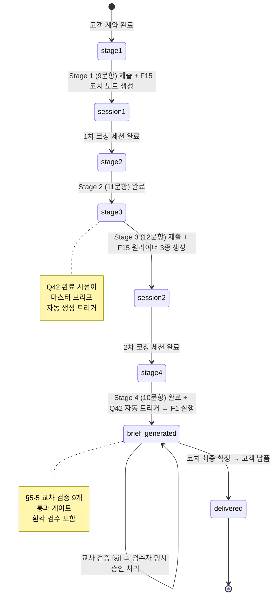

**PROJECT.status ENUM 전체 값 및 전이 조건**

| 상태 | 진입 조건 | 탈출 조건 |
| :--- | :--- | :--- |
| `stage1` | 고객 계약 완료, 프로젝트 생성 | Stage 1 제출 완료 + F15 코치 노트 생성 |
| `session1` | Stage 1 F15 완료 | 1차 코칭 세션 종료 (코치 수동 전환) |
| `stage2` | 1차 세션 완료 | Stage 2 (11문항) 응답 완료 |
| `stage3` | Stage 2 완료 | Stage 3 제출 완료 + F15 원라이너 3종 생성 |
| `session2` | Stage 3 F15 완료 | 2차 코칭 세션 종료 (코치 수동 전환) |
| `stage4` | 2차 세션 완료 | Stage 4 완료 + Q42 자동 트리거 발동 |
| `brief_generated` | Q42 완료 → F1 자동 실행 | 코치 최종 확정 승인 |
| `delivered` | 코치 확정 + 고객 납품 완료 | 종료 |

---

### 6.5 Class Diagram (Domain Model) *(GAP-002 보완)*

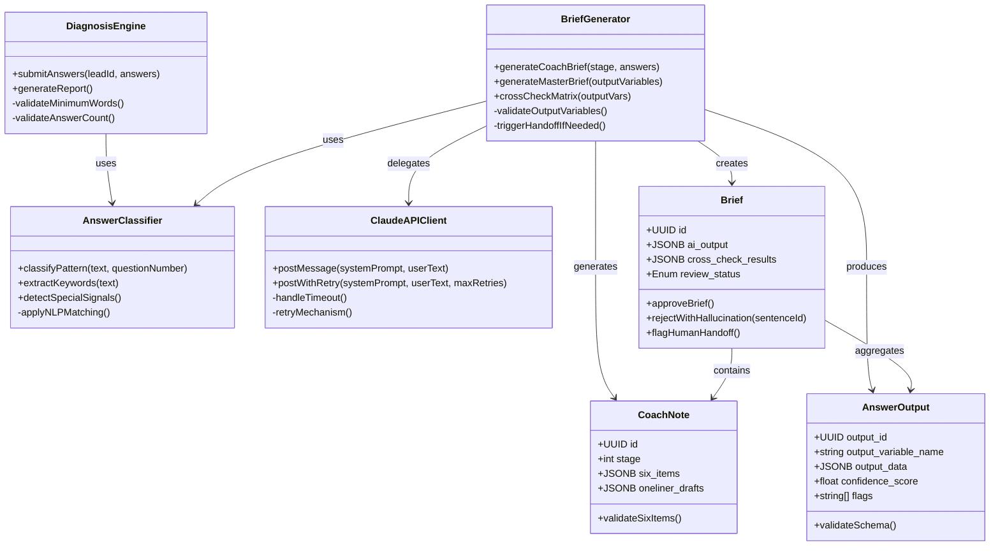

---

### 6.6 Validation Plan (검증 계획 요약)

| 실험 ID | 가설 | 성공 기준 | 관련 REQ-ID |
| :---: | :--- | :--- | :--- |
| E5 | 42문항 AI 분석 ↔ 코치 분석 일치율 ≥ 80% | AI-코치 일치율 ≥ **80%** | REQ-NF-030 |
| E6 | 12문항 진단 CTA 클릭율 5문항 대비 1.5배 | 12문항 그룹 CTA **≥ 1.5배** | REQ-NF-044 |
| E7 | 안내 문구 포함 완주율 +15%p | 완주율 **+15%p** | REQ-FUNC-011 |
| E8 | 패턴 기반 피드백 만족도 ≥ 4.3/5.0 | **≥ 4.3/5.0** | REQ-NF-032 |
| E9 | F15 코치 노트 동의율 ≥ 85%, 준비 시간 단축 ≥ 75% | 동의율 ≥ **85%**, 단축 ≥ **75%** | REQ-NF-037, REQ-NF-039 |
| E10 | 원라이너 3종으로 2차 세션 시간 ≥ 50% 단축 | 단축 ≥ **50%** | REQ-NF-038 |
| E11 | §5-4 의사 코드 스펙 → 42 OUTPUT 사양 준수 | 스키마 일치 **100%**, 환각 < **5%**, 분류 ≥ **85%**, 교차 검증 ≥ **80%** | REQ-FUNC-100~102, REQ-NF-036 |

---

### 6.7 예외 처리 — LLM API 타임아웃 흐름 *(v1.1 이동: §3.4 → §6.7)*

> **편집 노트:** 오류 처리 흐름은 핵심 비즈니스 시퀀스와 분리하여 예외 처리 섹션에 배치한다.

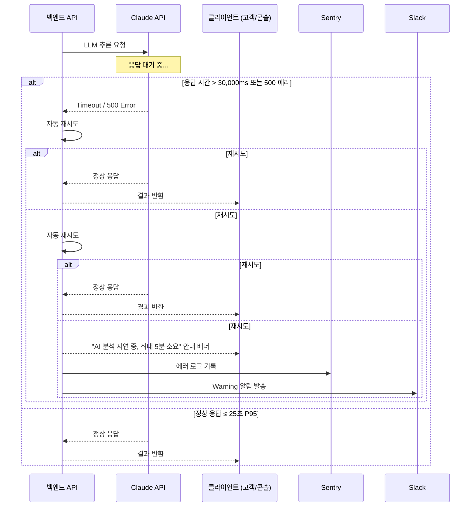

**오류 코드 기준**

| 에러 유형 | HTTP 코드 | 처리 방식 | 알림 |
| :--- | :---: | :--- | :--- |
| LLM API Timeout | 504 | 최대 2회 재시도 → 안내 배너 | Sentry 기록 + Slack Warning |
| LLM API 서버 오류 | 500 | 최대 2회 재시도 → 안내 배너 | Sentry 기록 + Slack Warning |
| 입력 유효성 실패 | 400 | 클라이언트 단 차단, 서버 미전송 | 없음 |
| 미승인 외부 전송 | 403 | 차단 + 경고 메시지 | AUDIT_LOG 기록 |
| DB INSERT 실패 | 500 | 롤백 + 에러 메시지 | Sentry Critical |
| 5분 내 5xx 5회 이상 | — | Slack Critical 자동 알람 | Slack Critical |

---

### 6.8 Open Issues Log *(P2 신설)*

| 이슈 ID | 심각도 | 이슈 설명 | 상태 | 목표 해소 시점 |
| :--- | :---: | :--- | :--- | :--- |
| OI-001 | Medium | PRD §10-4 API 표가 "기존 v0.2 유지"로만 명시되어 있어 실제 API 표가 PRD에 없음 → SRS API 목록의 PRD 완전성 검증 불가 | Open | PRD v0.5 업데이트 시 |
| OI-002 | Medium | V2 정규화 후보 엔터티(QUESTION, BRANDING_ELEMENT 등)의 구체적 스키마가 아직 미정 | Open | V1.5 설계 착수 전 |
| OI-003 | Low | CLASSIFY 대상 문항 수 확정 필요: PRD §5-4-6 기준 15문항, EXTRACT 기준 17문항. 향후 문항 추가 시 REQ-FUNC-055·101 동기 수정 필요 | Open | 의사 코드 System Prompt 이식 완료 후 |
| OI-004 | Low | 168 패턴(코치용 풀) vs 126 패턴(AI 정본) 두 가이드의 동기화 정책 미정 (향후 업데이트 시 어느 가이드를 기준으로 갱신할 것인지) | Open | E9·E11 실험 완료 후 |
| OI-005 | Low | API별 Request/Response JSON 스키마 상세 명세 부재 (목록 수준만 정의됨) | Open | 개발 착수 시 OpenAPI Spec으로 보완 |

---

*SRS-001 v1.1 — End of Document*
*Source of Truth: PRD_v0_4_2.md (2026-04-25)*
*Review Source: SRS_검토_결과서_PRD_v0_4_2_vs_SRS_v1_0.md (2026-04-26)*
*Standard: ISO/IEC/IEEE 29148:2018*
