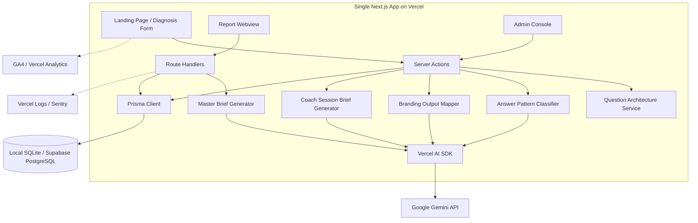

# SRS v1.2 개정 적용 Plan 문서  
## Next.js 단일 풀스택 MVP 아키텍처 반영 및 MVP 가치 전달 검증 계획

- **문서명**: SRS v1.2 개정 적용 Plan
- **대상 문서**: `SRS_v0_2.md`
- **개정 목표**: 기존 SRS의 제품 요구사항은 유지하되, 구현 아키텍처를 Next.js 단일 풀스택 MVP 기술 스택에 맞게 전면 재정렬한다.
- **적용 기술 스택**: Next.js App Router, Server Actions, Route Handlers, Prisma, SQLite, Supabase PostgreSQL, Tailwind CSS, shadcn/ui, Vercel AI SDK, Google Gemini API, Vercel
- **작성일**: 2026-04-26

---

## 1. 핵심 결론

이번 개정 작업의 본질은 **기능 축소가 아니라 구현 구조의 재정렬**이다.

현재 SRS는 제품 기능 관점에서는 MVP 핵심 가치 전달에 필요한 요소를 충분히 포함하고 있다.  
다만 기술 구조가 기존의 Claude API, Supabase JSONB 직접 사용, API Gateway, Retool, Datadog/UptimeRobot 중심으로 작성되어 있어, 의도한 MVP 기술 스택과 충돌한다.

따라서 본 작업의 목표는 다음과 같다.

> **제품의 핵심 사용자 경험은 유지하면서, 구현 방식을 Next.js 단일 풀스택 구조로 전환한다.**

최종 판단은 다음과 같다.

| 평가 항목 | 판단 |
|---|---|
| MVP 기능 요구 유지 가능성 | 가능 |
| 사용자 가치 전달 훼손 여부 | 원칙적으로 훼손되지 않음 |
| 기술 스택 변경으로 인한 주요 리스크 | AI 품질, 장시간 생성 처리, 관리자 콘솔 완성도, DB 마이그레이션 |
| 보완 방식 | 구조화 출력 스키마, 관리자 검수 흐름, 처리 상태 모델, 최소 관리자 콘솔, Prisma Schema 보완 |
| 최종 권장 방향 | SRS v1.2를 “Next.js Single Fullstack MVP Architecture 반영본”으로 개정 |

---

## 2. 개정 작업의 목표

### 2.1 Why — 왜 개정하는가

현재 SRS는 MVP 기능 범위는 충실하지만, 실제 개발을 시작하기에는 기술 아키텍처가 분산되어 있다.

기존 SRS에는 다음 전제가 포함되어 있다.

- Claude API 중심 LLM 호출
- Supabase JSONB 직접 저장 중심
- API Gateway 개념
- Next.js 또는 Retool 관리자 콘솔
- Datadog / UptimeRobot / Typeform 등 다수 외부 도구
- 모든 기능을 REST API Endpoint 중심으로 명세

그러나 의도하는 MVP 스택은 다음과 같다.

- Next.js App Router 기반 단일 풀스택 애플리케이션
- Server Actions / Route Handlers 중심 서버 로직
- Prisma 기반 DB 접근
- 로컬 SQLite, 운영 Supabase PostgreSQL
- Vercel AI SDK 기반 LLM 오케스트레이션
- Google Gemini API 기본 사용
- Vercel 기반 배포 및 운영

따라서 개정 목표는 기능 요구사항을 다시 만드는 것이 아니라, **개발자가 바로 구현 가능한 기술 명세로 재작성하는 것**이다.

---

### 2.2 What — 무엇을 바꿀 것인가

이번 개정에서 바꿀 영역은 다음 9개다.

| # | 개정 영역 | 변경 방향 |
|---:|---|---|
| 1 | Constraints | Claude·Supabase JSONB 중심 제약을 Next.js 단일 풀스택 제약으로 교체 |
| 2 | External Systems | Gemini, Vercel AI SDK, Prisma, Supabase PostgreSQL, Vercel 중심으로 재정의 |
| 3 | Component Diagram | Client/Backend/API Gateway 분리 구조를 Single Next.js App 구조로 변경 |
| 4 | API Overview | REST API 중심 목록을 Server Actions / Route Handlers / Internal Services로 재분류 |
| 5 | Data Model | Supabase JSONB 설명을 Prisma Schema 기준으로 재정리 |
| 6 | AI Orchestration | Claude API 직접 호출을 Vercel AI SDK + Gemini provider 구조로 변경 |
| 7 | Error Handling | LLM timeout, retry, failed state, pending state, review_required state를 명시 |
| 8 | MVP Prioritization | 교차검증 9개, 42문항 자동화 등은 MVP/P1/V1.5로 재분류 |
| 9 | Open Issues | AI JSON Schema, 인증, 마이그레이션, 장시간 작업 처리 이슈 추가 |

---

### 2.3 How — 어떻게 적용할 것인가

개정 작업은 다음 6단계로 진행한다.

| 단계 | 작업명 | 핵심 산출물 |
|---:|---|---|
| Phase 0 | 기준 정렬 | 개정 원칙, MVP 보존 원칙, 변경 범위 확정 |
| Phase 1 | SRS 구조 개정 | Constraints, External Systems, Component Diagram, API Overview 수정 |
| Phase 2 | 구현 명세 보강 | Server Actions, Route Handlers, Service Layer, Prisma Schema 초안 |
| Phase 3 | AI 처리 구조 재설계 | Vercel AI SDK, Gemini provider, JSON Schema, retry/error handling |
| Phase 4 | MVP 가치 전달 검증 | 고객 여정별 가치 훼손 여부 검토 |
| Phase 5 | 개발 착수 준비 | To-do backlog, Definition of Done, 리스크 관리표 확정 |

---

## 3. 개정 원칙

이번 작업에서는 아래 원칙을 따른다.

| 원칙 | 설명 |
|---|---|
| 기능 요구는 유지 | 고객에게 전달되는 핵심 기능은 삭제하지 않는다. |
| 구현 복잡도는 축소 | 별도 백엔드 서버, Python 서버, Retool 의존, 과도한 외부 모니터링 도구는 MVP에서 제외하거나 축소한다. |
| 사람 검수는 유지 | AI 생성 결과를 무검수로 고객에게 전달하지 않는다. |
| 진단 경험은 유지 | 축약 12~16문항 기반 자기인식 경험과 즉시 리포트 제공은 유지한다. |
| 브랜드 자산화 흐름은 유지 | 답변 → 패턴 분석 → 코칭 개입 → 브랜드 자산 매핑 → 산출물 생성 흐름은 유지한다. |
| 모델 교체 가능성 확보 | Gemini를 기본으로 하되, Vercel AI SDK 표준 인터페이스를 통해 향후 모델 교체가 가능해야 한다. |
| 데이터 이식성 확보 | SQLite 개발환경과 Supabase PostgreSQL 운영환경 간 migration 가능성을 보장한다. |
| 품질 측정 가능성 확보 | AI 정확도, 환각률, 코치 채택률, 고객 동의율을 측정할 수 있는 로그 구조를 둔다. |

---

## 4. 상세 작업 계획

## Phase 0. 기준 정렬

### 목적

SRS v1.2 개정의 범위와 원칙을 확정한다.

### 주요 작업

| 작업 ID | 작업 | 설명 | 산출물 |
|---|---|---|---|
| P0-01 | 변경 범위 확정 | 기술 구조 변경이 기능 요구 삭제가 아님을 명시 | 개정 범위표 |
| P0-02 | MVP 가치 보존 기준 정의 | 고객이 체감해야 하는 핵심 가치를 정의 | MVP 가치 보존 체크리스트 |
| P0-03 | 우선순위 재정의 | Must / Should / V1.5 / V2 구분 | 우선순위 Matrix |
| P0-04 | 용어 정리 | API Gateway, Server Action, Route Handler, Internal Service 용어 구분 | 용어표 |

### 완료 기준

- SRS v1.2의 개정 목표가 “기능 축소”가 아니라 “기술 아키텍처 재정렬”로 명시되어야 한다.
- MVP에서 반드시 유지해야 할 고객 경험이 정의되어야 한다.

---

## Phase 1. SRS 기술 구조 전면 개정

### 1.1 Constraints 교체

기존 Constraints는 다음 전제를 포함하고 있다.

- Claude 3.5 API 채택, 대체 불가
- Supabase JSONB 구조를 1스프린트 핵심 전략으로 사용
- 관리자 콘솔 API 연동 중심
- Claude System Prompt 중심

이를 다음 구조로 교체한다.

```markdown
#### Constraints (제약사항 및 가정) — MVP 기술 스택 기준

| # | 구분 | 내용 |
| :---: | :--- | :--- |
| C-TEC-001 | Framework | 모든 서비스는 Next.js App Router 기반의 단일 풀스택 애플리케이션으로 구현한다. |
| C-TEC-002 | Server Logic | 서버 측 로직은 Next.js Server Actions 또는 Route Handlers로 구현한다. |
| C-TEC-003 | Database | 로컬 개발환경은 Prisma + SQLite, 운영환경은 Prisma + Supabase PostgreSQL을 사용한다. |
| C-TEC-004 | UI | UI 및 스타일링은 Tailwind CSS와 shadcn/ui를 사용한다. |
| C-TEC-005 | AI Orchestration | LLM 오케스트레이션은 Vercel AI SDK로 처리한다. |
| C-TEC-006 | LLM Provider | 기본 LLM은 Google Gemini API를 사용한다. |
| C-TEC-007 | Deployment | 배포 및 인프라는 Vercel로 단일화한다. |
| C-TEC-008 | Human Review | AI 생성 결과는 운영자/코치 검수 후 고객에게 제공한다. |
| C-TEC-009 | Data Protection | 고객 답변과 자기서사 데이터는 AI 학습용으로 재사용하지 않는다. |
```

### 1.2 External Systems 수정

| 기존 | 변경 |
|---|---|
| Claude API | Google Gemini API |
| Supabase Client SDK 중심 | Prisma + Supabase PostgreSQL |
| Typeform 필수 | MVP에서는 선택 또는 수동 설문 가능 |
| Datadog / UptimeRobot | Vercel Logs / Sentry 중심 |
| Retool 가능 | MVP에서는 Next.js 관리자 콘솔 우선 |
| API Gateway | Next.js Route Handlers / Server Actions |

### 1.3 Component Diagram 교체

기존 구조는 Client Tier, Backend Tier, Data Tier가 분리된 구조다.  
변경 후에는 단일 Next.js App on Vercel 구조로 재정리한다.



### 완료 기준

- SRS에 더 이상 “Claude 대체 불가”, “API Gateway 필수”, “Retool 전제”가 남아 있지 않아야 한다.
- 모든 핵심 서버 로직은 Server Actions / Route Handlers / Internal Services 중 하나로 분류되어야 한다.

---

## Phase 2. API 및 서버 로직 재분류

### 목적

기존 API Endpoint 중심 명세를 Next.js MVP 구현 방식에 맞게 재분류한다.

### 재분류 기준

| 유형 | 사용 대상 | 예시 |
|---|---|---|
| Server Actions | 내부 폼 제출, 관리자 검수, DB mutation | createLead, submitDiagnosis, reviewBrief |
| Route Handlers | 외부 접근 URL, 웹훅, AI 장시간 처리, 리포트 조회 | `/api/reports/[id]`, `/api/ai/master-brief` |
| Internal Services | 비즈니스 로직, AI 처리 모듈 | classifyPattern, mapBranding, generateMasterBrief |
| Scheduled Route | 예약 실행 | follow-up survey, status check |

### 변경 후 API/Action 설계

| 기능 | 기존 Endpoint | 변경 후 구현 방식 | 비고 |
|---|---|---|---|
| 리드 생성 | `POST /api/leads` | `createLead()` Server Action | 고객 폼 제출 |
| 진단 제출 | `POST /api/diagnosis/submit` | `submitDiagnosis()` Server Action | 저장 후 진단 리포트 생성 |
| 리포트 조회 | `GET /api/reports/{id}` | Route Handler 또는 Server Component fetch | 공유 URL 고려 |
| 패턴 분류 | `POST /api/ai/classify-patterns` | Internal Service + 필요 시 Route Handler | 관리자 테스트 가능 |
| 브랜딩 매핑 | `POST /api/ai/map-branding` | Internal Service | F10 결과와 연결 |
| 코치 분석 노트 | `POST /api/ai/coach-brief` | Internal Service + Route Handler | 장시간 처리 가능성 |
| 마스터 브리프 생성 | `POST /api/ai/master-brief` | Route Handler + Service | 상태 저장 필요 |
| 브리프 검수 | `PATCH /api/briefs/{id}/review` | `reviewBrief()` Server Action | 관리자 콘솔 내부 처리 |
| 프로젝트 목록 | `GET /api/admin/projects` | Server Component fetch 또는 Route Handler | 관리자 권한 필요 |
| 고객 대시보드 | `GET /api/clients/{id}/dashboard` | V1.5 이후 | MVP 제외 가능 |

### 완료 기준

- 모든 기존 API가 Server Action, Route Handler, Internal Service, V1.5 이후 중 하나로 분류되어야 한다.
- 외부 호출이 필요 없는 내부 기능은 불필요하게 public API로 노출하지 않아야 한다.
- 관리자 기능은 인증/권한 체크를 통과해야 한다.

---

## Phase 3. 데이터 모델 및 Prisma Schema 보강

### 목적

기존 Supabase JSONB 중심 데이터 설명을 실제 구현 가능한 Prisma Schema 기준으로 구체화한다.

### 핵심 엔터티

| 엔터티 | 역할 | MVP 필요 여부 |
|---|---|---|
| User | 관리자/코치/고객 식별 | P0 |
| Lead | 진단 신청자 정보 | P0 |
| Diagnosis | 16문항 진단 응답 및 리포트 | P0 |
| Answer | 질문별 원문 답변 | P0 |
| Question | 42문항 메타데이터 | P0 |
| AiRun | AI 호출 이력 및 상태 | P0 |
| Brief | 코치 노트, 원라이너, 마스터 브리프 | P0 |
| ReviewLog | 승인/수정/거부 이력 | P0 |
| CrossCheckResult | 교차 검증 결과 | P1 |
| Feedback | 고객 동의율/NPS/만족도 | P1 |

### Prisma Schema 설계 방향

```prisma
model Lead {
  id          String   @id @default(cuid())
  name        String
  email       String?
  phone       String?
  channel     String?
  status      String   @default("new")
  createdAt   DateTime @default(now())
  diagnoses   Diagnosis[]
}

model Diagnosis {
  id          String   @id @default(cuid())
  leadId      String
  lead        Lead     @relation(fields: [leadId], references: [id])
  status      String   @default("submitted")
  reportJson  Json?
  scoreJson   Json?
  createdAt   DateTime @default(now())
  answers     Answer[]
  aiRuns      AiRun[]
}

model Answer {
  id           String   @id @default(cuid())
  diagnosisId  String
  diagnosis    Diagnosis @relation(fields: [diagnosisId], references: [id])
  questionCode String
  answerText   String
  metadataJson Json?
  createdAt    DateTime @default(now())
}

model Brief {
  id               String   @id @default(cuid())
  diagnosisId       String
  status            String   @default("draft")
  coachNoteJson     Json?
  onelinerJson      Json?
  masterBriefJson   Json?
  crossCheckJson    Json?
  reviewStatus      String   @default("pending")
  createdAt         DateTime @default(now())
  updatedAt         DateTime @updatedAt
}

model AiRun {
  id            String   @id @default(cuid())
  diagnosisId   String?
  taskType       String
  provider       String   @default("gemini")
  modelName      String?
  status         String   @default("pending")
  inputJson      Json?
  outputJson     Json?
  errorMessage   String?
  startedAt      DateTime?
  completedAt    DateTime?
  createdAt      DateTime @default(now())
}

model ReviewLog {
  id          String   @id @default(cuid())
  targetType  String
  targetId    String
  action      String
  comment     String?
  beforeJson  Json?
  afterJson   Json?
  createdAt   DateTime @default(now())
}
```

### 주의할 점

| 이슈 | 대응 |
|---|---|
| SQLite와 PostgreSQL의 JSON 처리 차이 | Prisma `Json` 타입 사용 후 양쪽 migration 테스트 |
| AI 출력 길이 | `String` 대신 `Json` 및 long text 저장 가능성 검토 |
| 상태값 남발 | MVP에서는 String enum처럼 사용, V1.5에서 enum 정리 |
| 개인정보 보호 | Lead와 Answer 접근 권한 분리 |
| 답변 원문 추적 | 모든 AI 산출물에 `sourceQuestionCodes` 포함 |

### 완료 기준

- 로컬 SQLite에서 `prisma migrate dev`가 성공해야 한다.
- Supabase PostgreSQL에서 `prisma migrate deploy`가 성공해야 한다.
- 핵심 seed data가 생성되어야 한다.
- 16문항 진단 → 답변 저장 → AI 리포트 저장 → 관리자 조회 흐름이 DB상에서 추적 가능해야 한다.

---

## Phase 4. AI 처리 구조 재설계

### 목적

Claude API 직접 호출 구조를 Vercel AI SDK + Gemini provider 기반으로 변경한다.

### AI 처리 원칙

| 원칙 | 설명 |
|---|---|
| 구조화 출력 우선 | 자연어 출력보다 JSON Schema 기반 결과를 우선한다. |
| 원문 근거 필수 | 모든 분석 결과는 질문 번호와 원문 인용을 포함해야 한다. |
| 환각 방지 | 답변에 없는 정보는 추정으로 표시하거나 생성하지 않는다. |
| 사람 검수 유지 | 고객에게 바로 전달하지 않고 관리자 검수 상태를 거친다. |
| 재시도 가능성 | 실패 시 동일 input으로 재실행할 수 있어야 한다. |
| 모델 교체 가능성 | Gemini를 기본으로 하되 provider abstraction을 유지한다. |

### AI Task 분리

| AI Task | 입력 | 출력 | MVP 우선순위 |
|---|---|---|---|
| classifyPatterns | answers[] | pattern labels, confidence, evidence | P0 |
| mapBrandingElements | answers[], patterns | branding element mapping | P0 |
| generateDiagnosisReport | 16 answers | brand score, strength, weakness, CTA copy | P0 |
| generateCoachBrief | Stage 1/3 answers | coach note 6 items | P0 |
| generateOneliners | answers + mappings | oneliner 3 versions | P0 |
| generateMasterBrief | answers + outputs | 8-section master brief | P0 |
| runCrossCheck | selected answer pairs | consistency score | P1 |
| suggestFollowupQuestions | weak answers | follow-up questions | P1 |

### AI 처리 상태 모델

```markdown
pending
→ processing
→ completed
→ review_required
→ approved
→ delivered

예외 흐름:
processing → failed
review_required → rejected
review_required → revision_requested
```

### AI 출력 JSON Schema 예시

```json
{
  "taskType": "generateOneliners",
  "status": "completed",
  "oneliners": [
    {
      "type": "expertise",
      "text": "나는 5060 전문가가 축적된 경력을 강의와 제안 자산으로 바꾸도록 돕는 브랜드 매니지먼트 코치입니다.",
      "sourceQuestionCodes": ["Q1", "Q6", "Q26", "Q41"],
      "evidenceQuotes": [
        {
          "questionCode": "Q1",
          "quote": "퇴직 이후에도 내 경험을 의미 있게 쓰고 싶다"
        }
      ],
      "confidence": 0.86
    }
  ],
  "warnings": [],
  "requiresHumanReview": true
}
```

### 완료 기준

- AI 출력은 Zod 또는 JSON Schema로 검증되어야 한다.
- 스키마 불일치 시 DB 저장이 차단되어야 한다.
- 모든 AI 출력에는 원문 근거가 포함되어야 한다.
- AI 생성 결과는 고객에게 직접 전달되지 않고 `review_required` 상태로 들어가야 한다.

---

## Phase 5. MVP 핵심 사용자 경험 가치 훼손 여부 검토

## 5.1 MVP 핵심 가치 정의

이 제품의 MVP 가치는 단순한 AI 진단이 아니다.  
핵심 가치는 다음 흐름에서 발생한다.

> **고객의 경력 서사 → 답변 패턴 분석 → 코칭적 해석 → 브랜드 자산 매핑 → 원라이너/마스터 브리프 산출 → 상담/매니지먼트 전환**

따라서 기술 스택 변경 후에도 아래 5가지 경험이 유지되어야 한다.

| 핵심 가치 | 설명 |
|---|---|
| 자기인식 | 고객이 자신의 경험을 새롭게 바라보는 경험 |
| 구조화 | 흩어진 경력과 생각이 브랜드 언어로 정리되는 경험 |
| 개인화 | AI 출력이 내 답변에 근거하고 있다는 느낌 |
| 신뢰 | 사람 코치가 검수한다는 안정감 |
| 전환 | 프리미엄 매니지먼트 상담으로 자연스럽게 이어지는 흐름 |

---

## 5.2 고객 여정별 가치 훼손 여부

| 고객 여정 | 기존 SRS 가치 | 기술 스택 변경 영향 | 훼손 여부 | 보완 조치 |
|---|---|---|---|---|
| 랜딩페이지 진입 | 서비스 신뢰 형성 | Next.js + Tailwind + shadcn/ui로 구현 가능 | 훼손 없음 | 브랜드 톤앤매너 컴포넌트 가이드 필요 |
| 16문항 진단 시작 | 자기인식 유도 | Server Action 기반 제출로 UX 유지 가능 | 훼손 없음 | 질문별 브랜드 자산 안내 문구 유지 |
| 답변 작성 | 경력 서사 수집 | DB 구조 변경은 고객에게 보이지 않음 | 훼손 없음 | 자동 저장 또는 임시 저장 추가 검토 |
| 진단 제출 | 즉시 리포트 기대 | Gemini 응답 품질에 따라 변동 가능 | 일부 리스크 | 구조화 프롬프트, 예시 few-shot, 스키마 검증 필요 |
| 진단 리포트 확인 | 강점/약점/브랜드 지수 확인 | Route Handler/Server Component로 충분 | 훼손 없음 | 30초 초과 시 처리중 안내 필요 |
| CTA 클릭 | 상담 전환 | GA4/Vercel Analytics로 측정 가능 | 훼손 없음 | CTA 문구와 상담 신청 flow 유지 |
| 관리자 검수 | 품질 통제 | Retool 대신 Next.js 콘솔 구현 필요 | 일부 리스크 | 최소 관리자 콘솔 P0로 포함 |
| 코치 분석 노트 | 세션 준비 시간 단축 | AI Task 분리로 구현 가능 | 훼손 없음 | Stage 1/3 노트 우선 구현 |
| 원라이너 3종 | 고객 체감 가치 높음 | Gemini 출력 품질 검증 필요 | 일부 리스크 | 코치 수정/승인 기능 필수 |
| 마스터 브리프 | 프리미엄 산출물 | 장시간 생성 처리 필요 | 일부 리스크 | `processing/review_required` 상태 모델 적용 |
| 최종 납품 | 신뢰와 완성도 | 사람 검수 유지 시 가치 유지 | 훼손 없음 | 무검수 자동 납품 금지 |

### 종합 판단

> 기술 스택 변경 자체는 MVP 핵심 사용자 경험을 훼손하지 않는다.  
> 다만 **Gemini 출력 품질, 관리자 콘솔 완성도, 장시간 AI 처리 상태 관리**가 미흡하면 고객이 느끼는 개인화·신뢰·완성도는 떨어질 수 있다.

---

## 5.3 가치 전달 보존 체크리스트

아래 조건을 만족하면 MVP 가치 전달은 보존된 것으로 판단한다.

| 체크 항목 | 기준 | 상태 |
|---|---|---|
| 진단 문항 유지 | Q1·Q2·Q4·Q6·Q7·Q8·Q9·Q11·Q13·Q15·Q26·Q28·Q33·Q40·Q41·Q42 유지 | 필수 |
| 질문별 자산 매핑 안내 | 각 질문이 어떤 브랜드 자산에 연결되는지 표시 | 필수 |
| 즉시 리포트 | 제출 후 브랜드 지수·강점·약점·CTA 표시 | 필수 |
| 원문 근거 표시 | AI 결과에 질문 번호와 답변 인용 포함 | 필수 |
| 사람 검수 | 최종 산출물은 운영자/코치 검수 후 제공 | 필수 |
| 원라이너 3종 | 전문성형·공감형·결과형 3가지 제공 | 필수 |
| 마스터 브리프 | 8개 섹션 구조 유지 | 필수 |
| 관리자 수정 기능 | AI 출력 수정·승인·거부 가능 | 필수 |
| 환각 차단 | 원문에 없는 해석은 검수 단계에서 차단 | 필수 |
| 상담 CTA | 프리미엄 매니지먼트 전환 흐름 유지 | 필수 |

---

## 5.4 가치 훼손 리스크와 대응 전략

| 리스크 | 발생 가능성 | 영향도 | 대응 |
|---|---:|---:|---|
| Gemini가 Claude 대비 한국어 코칭 뉘앙스가 약할 수 있음 | 중 | 높음 | few-shot 예시, 톤 가이드, 검수자 평가 데이터 구축 |
| 16문항만으로 개인화가 약할 수 있음 | 중 | 중 | 보완 질문 자동 생성, 관리자 추가 인터뷰 필드 제공 |
| 관리자 콘솔이 부실하면 Done-for-you 품질 저하 | 중 | 높음 | 관리자 콘솔 P0 범위 명확화 |
| 장시간 마스터 브리프 생성 실패 | 중 | 높음 | 상태 모델, 재시도, 수동 재생성 버튼 |
| SQLite/PostgreSQL 차이로 배포 오류 | 중 | 중 | migration 리허설, seed data, staging DB 운영 |
| AI JSON 출력 불안정 | 중 | 높음 | Zod schema validation, 재생성 로직 |
| 교차검증 9개 전체 구현으로 일정 지연 | 높음 | 중 | MVP는 핵심 3개만 구현 |
| 인증/권한 미흡 | 중 | 높음 | admin-only route guard, middleware 적용 |

---

## Phase 6. 개발 착수 준비 산출물

### 6.1 최종 산출물 목록

| 산출물 | 목적 | 우선순위 |
|---|---|---|
| SRS v1.2 개정본 | 공식 요구사항 문서 | P0 |
| Technical Architecture 문서 | 구현 구조 명세 | P0 |
| Prisma Schema 초안 | DB 구현 기준 | P0 |
| Server Actions 목록 | mutation 구현 기준 | P0 |
| Route Handlers 목록 | API 구현 기준 | P0 |
| AI Task 명세서 | LLM 호출 단위 정의 | P0 |
| AI JSON Schema | 구조화 출력 검증 | P0 |
| Admin Console Wireframe | 검수 UX 기준 | P0 |
| MVP UX Preservation Checklist | 가치 훼손 방지 기준 | P0 |
| Implementation Backlog | 개발 작업 목록 | P0 |
| QA Test Case | 기능 검증 기준 | P1 |

---

## 7. 구현 Backlog 초안

## Epic 1. Project Foundation

| Task ID | 작업 | 완료 기준 |
|---|---|---|
| FEAT-001 | Next.js App Router 프로젝트 생성 | Vercel 배포 가능한 기본 프로젝트 생성 |
| FEAT-002 | Tailwind CSS + shadcn/ui 설정 | 기본 UI 컴포넌트 사용 가능 |
| FEAT-003 | Prisma 설정 | SQLite 로컬 연결 성공 |
| FEAT-004 | Supabase PostgreSQL 연결 | production DB 연결 확인 |
| FEAT-005 | 환경 변수 구조 정의 | local/production env 분리 |

---

## Epic 2. Diagnosis Flow

| Task ID | 작업 | 완료 기준 |
|---|---|---|
| FEAT-010 | 16문항 메타데이터 구성 | 질문 코드, PART, Stage, 브랜드 자산 매핑 포함 |
| FEAT-011 | 진단 폼 UI 구현 | 16문항 순서대로 렌더링 |
| FEAT-012 | 리드 생성 Server Action | Lead DB 저장 성공 |
| FEAT-013 | 진단 제출 Server Action | Answer/Diagnosis 저장 성공 |
| FEAT-014 | 답변 유효성 검사 | 3단어 미만 또는 무의미 답변 차단 |
| FEAT-015 | 진단 완료 화면 | 리포트 생성 상태 표시 |

---

## Epic 3. AI Diagnosis Report

| Task ID | 작업 | 완료 기준 |
|---|---|---|
| FEAT-020 | Vercel AI SDK 설정 | Gemini API 호출 성공 |
| FEAT-021 | 진단 리포트 프롬프트 작성 | 강점/약점/브랜드 지수 출력 |
| FEAT-022 | AI JSON Schema 작성 | 스키마 검증 통과 |
| FEAT-023 | 리포트 저장 | Diagnosis.reportJson 저장 |
| FEAT-024 | 리포트 웹뷰 구현 | 고객이 결과 확인 가능 |
| FEAT-025 | CTA 버튼 구현 | 상담 신청 또는 문의 연결 가능 |

---

## Epic 4. Admin Console

| Task ID | 작업 | 완료 기준 |
|---|---|---|
| FEAT-030 | 관리자 인증 구조 설정 | 비관리자 접근 차단 |
| FEAT-031 | 프로젝트 목록 화면 | Lead/Diagnosis/Brief 상태 표시 |
| FEAT-032 | 진단 상세 화면 | 답변 원문, AI 리포트 조회 |
| FEAT-033 | AI 출력 검수 UI | 승인/수정/거부 가능 |
| FEAT-034 | ReviewLog 저장 | 검수 이력 기록 |
| FEAT-035 | 재생성 버튼 | AI Run 재실행 가능 |

---

## Epic 5. Coach Brief & Oneliner

| Task ID | 작업 | 완료 기준 |
|---|---|---|
| FEAT-040 | Stage 1 코치 노트 생성 | 6항목 출력 |
| FEAT-041 | Stage 3 코치 노트 생성 | 6항목 + 원라이너 3종 출력 |
| FEAT-042 | 원라이너 JSON Schema | 3종 각각 source/evidence 포함 |
| FEAT-043 | 원라이너 검수 UI | 선택/수정/승인 가능 |
| FEAT-044 | 원문 인용 표시 | 질문 번호와 답변 일부 표시 |

---

## Epic 6. Master Brief

| Task ID | 작업 | 완료 기준 |
|---|---|---|
| FEAT-050 | 마스터 브리프 생성 Service | 8개 섹션 생성 |
| FEAT-051 | 처리 상태 모델 구현 | pending/processing/completed/failed |
| FEAT-052 | 마스터 브리프 검수 UI | 섹션별 수정/승인 가능 |
| FEAT-053 | 원천 답변 추적 | 각 섹션별 sourceQuestionCodes 포함 |
| FEAT-054 | 최종 납품 상태 변경 | approved/delivered 상태 관리 |

---

## Epic 7. Cross-check & Quality

| Task ID | 작업 | 완료 기준 |
|---|---|---|
| FEAT-060 | Q1↔Q41 정체성 변화 분석 | 변화 리포트 생성 |
| FEAT-061 | Q6×Q20 가치 일관성 점수 | 0~1 점수 산출 |
| FEAT-062 | Q26+Q33 페르소나 통합 | 페르소나 카드 생성 |
| FEAT-063 | 환각 태깅 기능 | Reject 시 보류 상태 전환 |
| FEAT-064 | AI 품질 로그 | 정확도/수정률/거부율 추적 가능 |

---

## 8. SRS v1.2 문서 개정 To-do

| 문서 섹션 | 작업 내용 | 우선순위 |
|---|---|---|
| 1.1 Purpose | 제품 목적은 유지, 기술 목적 추가 | P0 |
| 1.2 Scope | MVP 범위 유지, 기술 Constraints 교체 | P0 |
| 1.3 Definitions | Server Actions, Route Handlers, Vercel AI SDK, Prisma 추가 | P0 |
| 1.4 References | Anthropic 문서 제거 또는 보조로 이동, Vercel/Next.js/Prisma/Gemini 추가 | P0 |
| 3.1 External Systems | Gemini, Supabase PostgreSQL, Vercel, GA4/Sentry 중심으로 수정 | P0 |
| 3.2 Component Diagram | Single Next.js App 구조로 교체 | P0 |
| 3.3 API Overview | Server Actions / Route Handlers / Internal Services로 재분류 | P0 |
| 3.4 Sequence Diagrams | Claude API를 Gemini/Vercel AI SDK로 교체 | P0 |
| 4.1 Functional Requirements | 기능은 유지하되 구현 방식 관련 문구 수정 | P0 |
| 4.2 Non-functional Requirements | Vercel 환경 기준 성능/가용성/에러 처리로 수정 | P1 |
| 5 Traceability Matrix | 기존 기능 추적성 유지, REQ-TEC 추가 | P0 |
| 6 Appendix | Prisma Schema, AI JSON Schema, Action/Route 목록 추가 | P0 |
| Open Issues | 인증, migration, long-running AI, schema validation 추가 | P0 |

---

## 9. Definition of Done

SRS v1.2 개정 작업은 아래 조건을 만족해야 완료로 본다.

| 완료 조건 | 기준 |
|---|---|
| 기술 스택 정합성 | 모든 기술 제약이 Next.js 단일 풀스택 구조와 일치 |
| 기능 보존 | 기존 MVP 기능 F1, F2, F3, F4, F9, F10, F11, F15가 삭제되지 않음 |
| API 재분류 | 기존 Endpoint가 Server Action / Route Handler / Service로 재분류됨 |
| DB 구현 가능성 | Prisma Schema 초안이 포함됨 |
| AI 구현 가능성 | Vercel AI SDK + Gemini + JSON Schema 구조가 포함됨 |
| 검수 흐름 유지 | AI 결과의 승인/수정/거부 흐름이 유지됨 |
| UX 가치 검증 | 고객 여정별 가치 훼손 여부 표가 포함됨 |
| MVP 우선순위 | P0/P1/V1.5/V2 구분이 명확함 |
| 리스크 대응 | 주요 리스크와 대응 전략이 포함됨 |
| 개발 착수 가능성 | Backlog 수준의 구현 작업이 도출됨 |

---

## 10. 최종 검토 결과

### 10.1 MVP 기능의 핵심 사용자 경험은 훼손되는가?

**결론: 훼손되지 않는다.**

이유는 다음과 같다.

1. 고객이 처음 만나는 진단 경험은 그대로 유지된다.
2. 16문항 기반 자기인식 흐름도 유지된다.
3. 진단 결과 리포트와 CTA도 유지된다.
4. AI가 답변 패턴을 분석하고 브랜드 자산으로 매핑하는 구조도 유지된다.
5. 원라이너 3종과 마스터 브리프라는 핵심 산출물도 유지된다.
6. 사람 코치 검수 구조가 유지되므로 프리미엄 서비스의 신뢰가 유지된다.
7. 기술 스택 변경은 고객이 보는 가치 흐름보다 내부 구현 방식을 바꾸는 작업에 가깝다.

---

### 10.2 단, 훼손될 수 있는 조건

다음 조건이 발생하면 MVP 가치는 훼손될 수 있다.

| 훼손 조건 | 이유 |
|---|---|
| Gemini 출력이 일반론적이면 | 고객이 “내 이야기를 짚었다”는 느낌을 받지 못함 |
| 관리자 콘솔이 부실하면 | 사람 검수 기반 Done-for-you 품질이 약해짐 |
| 원문 인용이 없으면 | AI 결과의 신뢰도가 떨어짐 |
| 리포트 생성이 오래 걸리고 안내가 없으면 | 즉시성 경험이 약해짐 |
| 16문항 답변이 너무 얕은데 보완 질문이 없으면 | 개인화가 약해짐 |
| 마스터 브리프가 자동 생성 후 검수 없이 전달되면 | 환각과 품질 리스크가 커짐 |

---

### 10.3 최종 권장 실행안

다음 순서로 진행하는 것이 가장 안전하다.

1. **SRS v1.2 문서 구조 개정**
2. **기술 Constraints 및 Component Diagram 교체**
3. **API Overview를 Server Actions / Route Handlers / Services로 재분류**
4. **Prisma Schema 초안 작성**
5. **AI Task별 JSON Schema 작성**
6. **관리자 콘솔 최소 기능 정의**
7. **MVP 가치 전달 체크리스트 반영**
8. **개발 Backlog로 전환**

---

## 11. 한 문장 요약

> 이번 개정은 MVP 기능을 줄이는 작업이 아니라, 고객에게 전달되는 진단·해석·브랜드 자산화 경험은 유지하면서 내부 구현 구조를 Next.js 단일 풀스택 MVP에 맞게 단순하고 실행 가능하게 바꾸는 작업이다.
